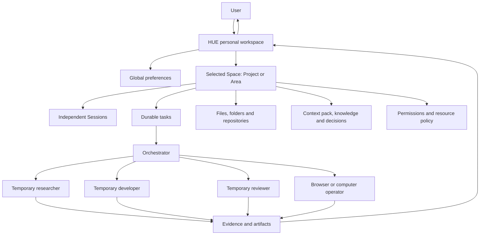

# HUE Vision

> **Specification status:** `SPEC`
> **Product status:** `TBI`
> **Open implementation choices:** `TBD`

## North star

HUE is an open-source, local-first **personal agent workspace**: an AI work operating system for projects and ongoing areas of life. It combines the conversational ease of a general assistant, the organization of Projects and permanent Areas, the portability of a second brain, the repository fluency of coding agents, and the visible delegation of a capable team—without making the user administer models, agents, providers, terminals and chat histories manually.

The central idea is **not one all-knowing agent**. The workspace establishes the correct context, memory, sources, permissions, tools and specialist for each independent session. Its durable “brain” is structured user-owned knowledge, current space state, decisions, source bindings and retrieval rules—not the context window of Hermes, OpenCode or any particular model.

The desired experience is simple:

> Open the right Project or Area, begin or resume a session, and let HUE establish the context and execution environment automatically; watch work progress, intervene when useful, and review verified results in context.

## The missing product

Today, users assemble fragments:

- A chat application understands general requests but has shallow project folders and little execution visibility.
- A coding agent works well inside one repository but is not a complete workspace for life, research, documents and native applications.
- An agent framework can coordinate workers but expects its user to be a software architect.
- A personal assistant has memory and tools but often hides orchestration, mixes contexts, or requires manual profile selection.
- A computer-use product can click through applications but does not own project history, code, tasks, memory and artifacts.

HUE makes those fragments one coherent product.

## Final product promise — `TBI`

When implemented, HUE will provide:

1. **One workspace, many independent contexts.** HUE provides one coherent front door while each session receives only the relevant global preferences and Space context.
2. **Projects, Areas and Resources.** Projects pursue finishable outcomes; Areas represent ongoing responsibilities; Resources provide reusable reference material with explicit relationships and access.
3. **Real spaces.** Each Project or Area binds goals, a human-readable context pack, source systems, files, knowledge, decisions, permissions, memories, sessions, tasks, artifacts and defaults.
4. **Sessions and execution together.** Discussion, execution, research, monitoring and review sessions stay independent; any session can create or connect to a durable task without switching products.
5. **Visible orchestration.** A bounded scheduler/router decomposes work, creates temporary specialists, shows dependencies and progress, and revises the plan when evidence changes.
6. **Autonomous resource selection.** HUE chooses an appropriate model, provider, effort, toolset, runtime and isolation level through transparent policy.
7. **OpenCode-first, replaceable development.** OpenCode is the initial primary software execution environment; worktrees, edits, tests, diffs, reviews and PR handoff remain defined by HUE contracts so other runtimes can replace or complement it.
8. **Cowork-class knowledge work.** Files, documents, spreadsheets, web research, browser activity and native computer use belong to the same workspace and task system.
9. **A portable knowledge substrate.** Human-readable context packs, explicit decisions, backlinks, tags, provenance and maintained summaries remain useful without the AI layer.
10. **Layered memory.** Session, Space, global preference, source and episodic archive layers remain distinct, inspectable and correctable.
11. **Source ownership.** GitHub, Calendar, email and user files remain authoritative for their native objects; HUE synchronizes projections and provides a control surface rather than creating stale parallel truth.
12. **Durable work.** Sessions and tasks survive page refreshes and process restarts; users can pause, resume, steer, branch and cancel.
13. **Proof, not claims.** Results link to changed files, test output, citations, recordings, screenshots and decision logs.
14. **Human authority.** Sensitive, external, irreversible and costly operations are policy-controlled and approval-gated.
15. **Open and adaptable.** HUE can use different model providers, worker runtimes, tool protocols and local or hosted infrastructure. Hermes and OpenCode sit behind HUE’s abstraction.

## Mental model

```text
HUE                         the personal workspace and control surface
Space                       a Project or Area context + permission boundary
Project                     a Space pursuing a finishable outcome
Area                        a Space representing an ongoing responsibility
Resource                    reusable reference linked to Spaces explicitly
Session                     an independent discussion/execution/research/monitor/review context
Conversation                the message stream inside a Session
Task                        a durable desired outcome with lifecycle
Run                         one execution attempt for a task
Plan                        an evolving graph of steps and dependencies
Worker                      a temporary specialist execution context
Tool                        a bounded capability invoked by a worker
Approval                    a human decision at a policy boundary
Artifact                    a durable output or evidence object
Knowledge/context pack      portable maintained state for a Space
Memory                      a curated fact/decision available to later work
Event                       an immutable record of what occurred during a run
```

## The intended relationship



## Product posture

HUE should feel like a **calm studio and personal operating workspace**, not an agent command center by default.

- The user sees outcomes, blockers, decisions and meaningful progress.
- The system keeps raw event detail available without forcing it into the primary conversation.
- Advanced users can inspect or override routing, models, tools and execution topology.
- New users can simply ask for work and understand what HUE is doing.

## What HUE is not

- Not a generic multi-agent SDK with a chat page attached.
- Not one omniscient assistant context expected to know every codebase and aspect of life.
- Not a thin wrapper around one model provider or agent framework.
- Not a collection of separately operated specialist bots.
- Not a project-management system that requires users to hand-maintain every task.
- Not an IDE replacement; it cooperates with editors and repositories while owning AI work context and execution.
- Not an unrestricted autonomous employee. Human policy, permissions and review remain fundamental.
- Not a system that calls an LLM for deterministic work a normal program can do better.

## Success criteria

HUE succeeds when a user can:

- move between unrelated Projects and Areas without context leakage or manual reconfiguration;
- run independent sessions concurrently without collapsing them into one context window;
- assign a complex outcome without selecting a model, provider, effort, agent type or directory;
- understand the plan and current status in under ten seconds;
- safely leave work running and later resume from a truthful durable record;
- review exactly what changed and why;
- correct memory and routing behavior without editing hidden prompts;
- use local data and local models where required while retaining optional cloud capability;
- replace several disconnected AI applications with one coherent workspace.

## Final review question

Every proposed feature should answer:

> Does this help HUE place an independent session inside the correct Space, assemble the right user-owned context, operate safely, organize work visibly, and return evidence-backed outcomes with less manual agent administration?

If not, it probably does not belong in the core product.
