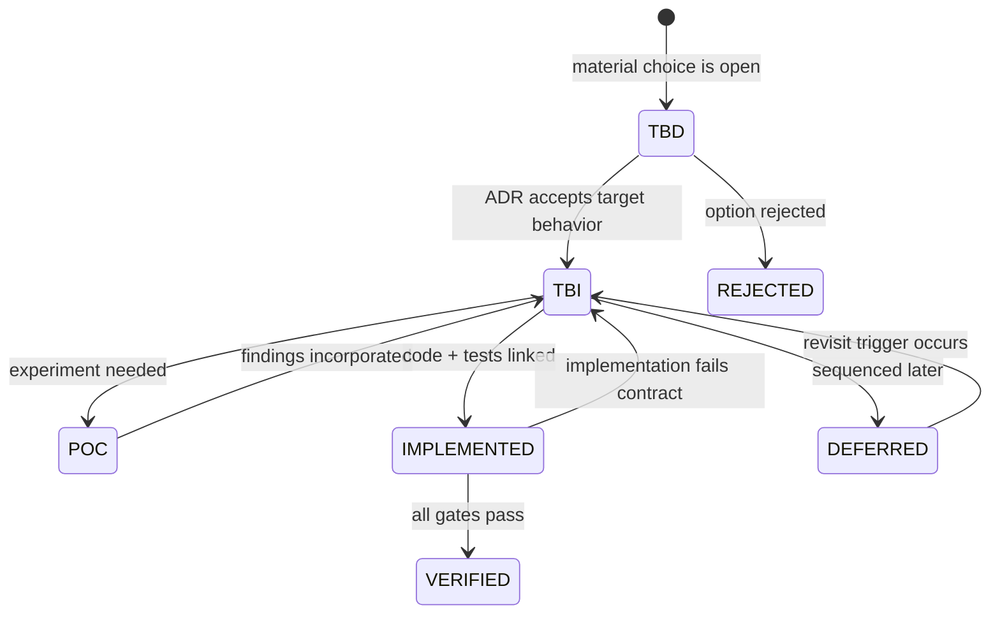

# Status, labels and review protocol

> **Document status:** `SPEC`
> **Capability status:** `TBI`

This repository deliberately separates **a well-specified feature** from **an implemented feature**. Product documentation is allowed to describe the final experience in present-tense user language, but every capability chapter must carry an implementation status.

## Canonical labels

| Label | Definition | Required evidence to advance |
|---|---|---|
| `TBI` | Requirement accepted; no conforming implementation exists. | A linked implementation issue may be opened. |
| `TBD` | Material choice remains open. | ADR accepted with decision, rationale and consequences. |
| `SPEC` | Reviewable specification exists. | Product review confirms behavior and boundaries. |
| `POC` | Disposable experiment answers one decision question. | Findings recorded in the relevant ADR; POC is not production. |
| `IMPLEMENTED` | Code claims to satisfy the specification. | PR/commit, tests and artifacts linked. |
| `VERIFIED` | Behavior has passed specified gates in a representative environment. | Automated plus manual evidence recorded. |
| `DEFERRED` | Intentionally postponed without rejecting the vision. | Reason and revisit trigger recorded. |
| `REJECTED` | Explicitly outside the product contract. | ADR or product decision explains why. |

## How status appears

Every product chapter begins with:

```text
Product status: TBI
Open choices: TBD-xxx, TBD-yyy
```

A section whose behavior is locked but unbuilt is marked:

> **TBI — target behavior:** This is required but not implemented.

A section that cannot be finalized until a choice is made is marked:

> **TBD-xxx — decision required:** The named options and decision criteria follow.

Mixed sections may include both. `TBD` never means “the agent may choose silently during implementation.”

## Status transition



## Documentation review protocol

Review in four passes:

1. **Product truth:** Does the described experience match what HUE should become?
2. **Boundary truth:** Are privacy, permission, project and memory boundaries explicit?
3. **Interaction truth:** Can the user understand, steer and trust the system?
4. **Implementation readiness:** Is each slice testable, and are unresolved choices represented as `TBD` rather than assumptions?

A reviewer can record feedback as:

```text
Document/section:
Status: accept | revise | reject | decision needed
Problem:
Desired change:
Consequences elsewhere:
```

## Definition of documentation complete

A capability is sufficiently specified for implementation only when it includes:

- intended user outcome;
- entry points and user journey;
- default, loading, empty, success, error, interrupted and recovery states;
- data and memory effects;
- permission and approval effects;
- observable acceptance criteria;
- non-goals;
- cross-links to open decisions;
- verification expectations.

## No false progress

The prototype contains clickable screens and plausible data solely to communicate interaction. It must not be interpreted as a working backend. Mock records are visibly labeled, and no product section becomes `IMPLEMENTED` because its wireframe exists.
