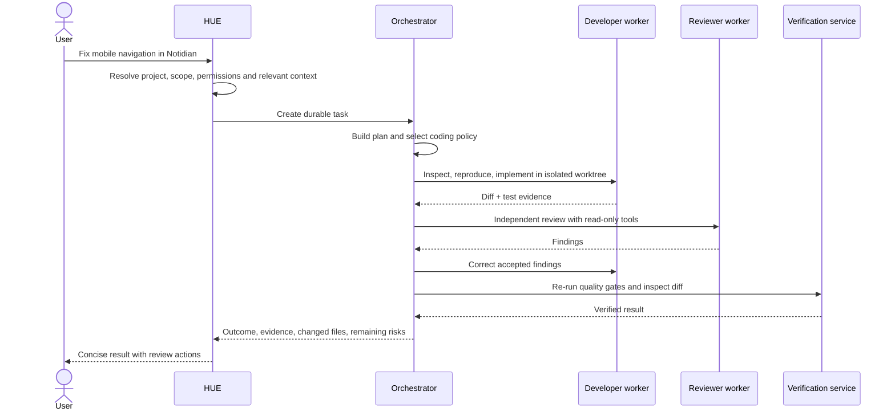

# Product experience and user journeys

> **Product status:** `TBI`
> **Open choices:** `TBD-005` task topology policy, `TBD-013` notification channels.

## Session modes

Every Session is independent, belongs to a Project or Area, and has one of five explicit modes. The mode changes defaults and available actions—not the user-facing identity of HUE.

### Discussion — `TBI`

The user asks, explores, drafts or decides. HUE may use lightweight tools but does not create durable execution machinery unless useful.

### Execution — `TBI`

The user requests an outcome whose work should persist. HUE creates a durable task, proposes or starts a plan according to policy, and reports through the task/run system.

The transition is explicit but low-friction:

```text
User: This direction works. Implement the first slice.
HUE: I’ll create a task in Notidian using the current decisions and repository.
     [Review plan] [Start] [Adjust scope]
```

Low-risk, well-scoped tasks may start automatically under project policy; higher-risk or ambiguous tasks pause for plan approval.

### Research — `TBI`

Source gathering, grading and synthesis with explicit possible outputs such as a maintained note, decision record or source-system task.

### Monitoring — `TBI`

A durable Session waiting for a schedule, threshold, source-system update or other condition. It does not occupy one continuous model context while idle.

### Review — `TBI`

Independent inspection of another Session’s implementation, evidence or claims under read-only or deliberately narrower permissions.

## Core journey A — open a Project and continue

1. User selects the **Notidian Project**.
2. Its Space overview shows active Sessions, tasks, recent artifacts, repository/source state and decisions needing attention.
3. User opens “Sync reliability” or starts another independent Session.
4. The Session automatically inherits Notidian’s primary workspace, human-readable context pack, selected sources, permissions and memory namespace.
5. HUE finds the related issue, branch, worktree and earlier OpenCode Session when available.
6. HUE states the active Space and exceptional constraints without dumping hidden context.

**Success:** no manual directory/model/profile setup and no context from unrelated Projects or Areas.

## Core journey A2 — move from a software Project to a permanent Area

1. User leaves the running Notidian execution Session and opens **Health**.
2. Health has no repository, branch or GitHub milestone. Its overview shows current goals, routine, observations, evidence and unresolved questions.
3. User starts “Afternoon hunger review”.
4. HUE loads the Health context pack and evidence policy but cannot access Notidian files, GitHub credentials or unrelated personal material.
5. Personal observations, agent inference, external evidence, professional advice and uncertainty remain visibly distinct.
6. Any durable conclusion is proposed as a context-pack/knowledge update rather than trusted because it appeared in a transcript.

**Success:** the workspace supports life Areas without pretending they are software projects, and concurrent Sessions remain isolated.

## Core journey B — assign a coding outcome



**Visible default:** task steps, current worker, blockers, approval state and elapsed time.
**Available on demand:** routing explanation, worker transcript, tool events, diff and test logs.

## Core journey C — research then produce an artifact

1. User asks for a current market comparison inside a project.
2. HUE recognizes research plus synthesis rather than a coding task.
3. A researcher gathers source-graded evidence; a writer or HUE synthesizes only when separation improves quality.
4. Citations and extracted evidence remain attached to the run.
5. The final report is stored as a project artifact and linked in the conversation.
6. Durable project facts are proposed as memory changes, not automatically copied from every source.

## Core journey D — work with a native application

1. User asks HUE to update a spreadsheet in Numbers.
2. HUE checks for a direct file/API path first.
3. If computer use is required, HUE creates a scoped computer-operator step with application, intended changes and risk class.
4. The user sees a preview of consequential actions.
5. HUE operates in the background where supported and verifies visible state after each mutation.
6. Saving, sending, publishing or overwriting crosses the configured approval boundary.
7. Screenshots/recording and output file become run evidence.

## Core journey E — recover interrupted work

1. A worker or application process disappears.
2. The task state becomes **Interrupted** or **Unknown**, never falsely **Failed** or **Done**.
3. HUE reconstructs the last durable checkpoint, external side-effect evidence and pending approvals.
4. The user chooses **Resume**, **Retry from checkpoint**, **Inspect**, or **Abandon**.
5. Before retrying side effects, HUE proves whether the earlier action occurred or asks the user.

## Core journey F — correct memory

1. HUE uses an outdated project assumption.
2. User opens **Why this context?** or corrects HUE in conversation.
3. HUE identifies the exact memory or instruction source.
4. User edits, supersedes, scopes or deletes it.
5. The correction is versioned with provenance and applies to future context assembly.

## Core journey G — override automatic routing

The normal user need not choose a model. An advanced user may say:

```text
Use Claude for the independent review, keep all other work local, and do not use computer control.
```

The resulting run policy displays those overrides, and lower-precedence Space/global rules cannot silently undo them.

## Core journey H — route an unfiled request from the universal inbox

1. User captures: “Research whether WebGPU would improve the Notidian canvas.”
2. HUE proposes **Destination: Notidian**, **Type: Research**, **Topic: Rendering architecture**, **Outputs: Decision record + GitHub issue**.
3. User accepts, changes or keeps it unfiled.
4. An accepted correction may influence routing preference only through explicit, inspectable learning; it does not create a hidden permanent classification.
5. If a GitHub issue is created later, GitHub remains its source of truth and HUE stores the binding/projection.

## Core journey I — maintain portable knowledge

1. A completed Session proposes an update to `current-state.md`, `decisions.md` or another context-pack role.
2. The user reviews the exact file/note change and provenance.
3. HUE writes the accepted revision and updates indexes/backlinks.
4. The same knowledge remains readable and navigable from ordinary files if HUE and all models are offline.

## Feedback contract

HUE responses during long work should answer one of four questions:

- **What is happening?** Plan and active step.
- **What changed?** Newly completed work or revised plan.
- **What needs me?** Approval, decision, missing input or safety concern.
- **What was proven?** Evidence-backed outcome.

Routine tool chatter does not interrupt the user.

## Task completion card — `TBI`

```text
Mobile navigation fixed                                  Verified

Changed
  4 files · +184 / −62 · isolated worktree

Proven
  ✓ responsive tests
  ✓ typecheck
  ✓ reviewer findings resolved
  ✓ mobile viewport recording

Needs you
  Review diff · Approve merge · Keep worktree

[Open artifact] [Review diff] [View run] [Create follow-up]
```

## Universal states

Every asynchronous screen or object must specify:

- default;
- loading;
- empty;
- running;
- waiting for dependency;
- waiting for user;
- paused;
- interrupted;
- failed;
- unknown outcome;
- completed but unverified;
- verified;
- cancelled;
- archived.

The UI must not collapse these into generic “done/error” states.
