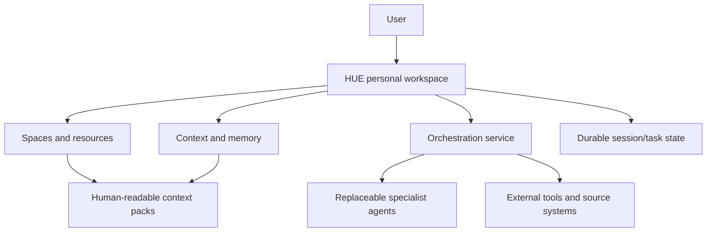

# Spaces, sessions, knowledge and source ownership

> **Product status:** `TBI`
> **Open choices:** `TBD-006` memory/knowledge engine, `TBD-007` canonical and derived storage, `TBD-016` cross-space retrieval, `TBD-017` sync/remote access.

## The workspace—not an omniscient agent

HUE’s visible product is a **personal agent workspace**. Its intelligence comes from giving each independent session the correct space, context pack, sources, tools, permissions and temporary specialist—not from keeping one model deeply informed about every codebase and area of life at once.

The orchestrator is a bounded scheduler and router inside the workspace. Hermes may initially implement parts of that service, and OpenCode may be the first software execution backend, but neither owns HUE’s spaces, sessions, knowledge or durable state.



## Space taxonomy — `TBI`

HUE organizes the user’s world around **spaces**, not agents.

### Project

A project aims at an outcome and can eventually be completed or archived.

Examples: Notidian, Pure3D, a consultancy engagement, an eScience initiative, a trading-system build.

A software project may bind repositories, GitHub issues/milestones, worktrees, build tools and coding sessions. A non-software project may instead bind documents, calendars, research sources and deliverables.

### Area

An area is an ongoing responsibility or domain without a natural completion date.

Examples: Health, Parenting, Career, Finances, Learning and Family planning.

Areas have goals, current situation, routines, observations, evidence, decisions, unresolved questions and periodic reviews. They are not forced into repository, sprint or milestone metaphors.

### Resource

A resource is reusable reference material that may serve many projects and areas.

Examples: People, Reading, a research library, Templates and Archive.

Resources do not automatically grant every linked space access. Relationships, retrieval and permissions remain explicit.

### Second brain

The second brain is the user-owned **knowledge substrate beneath spaces**, not a competing top-level bucket. Notes can be related to one or more spaces through backlinks, tags and explicit relationships while remaining portable and useful without HUE or any AI model.

## What every space contains — `TBI`

Projects and areas share a stable container:

```text
<Space>
├── Overview
├── Sessions
├── Tasks
├── Knowledge
├── Files
├── Decisions
├── Activity
└── Settings
```

The meaning adapts to the space type.

| View | Project example | Area example |
|---|---|---|
| Overview | milestones, PRs, branches, blockers | goals, routines, observations, questions |
| Sessions | implementation, research, review | discussion, evidence review, weekly reflection |
| Tasks | GitHub issues and manual outcomes | commitments, routines, follow-ups |
| Knowledge | architecture and requirements | evidence, constraints and maintained guidance |
| Files | repository and project documents | selected notes, reports and records |
| Decisions | accepted technical/product choices | accepted personal strategy with provenance |
| Activity | agent/GitHub/file changes | observations, reviews and state changes |
| Settings | roots, GitHub, build policy | sources, evidence policy, sensitive access |

## Sessions — `TBI`

A session is an independent, space-bound working context. Multiple sessions in one space can run concurrently without sharing one confused context window.

Initial session types:

- **Discussion:** questions, planning, drafting and thinking.
- **Execution:** connected to OpenCode or another action-capable runtime.
- **Research:** gathers, grades and synthesizes external evidence.
- **Monitoring:** waits for a condition, schedule or external event.
- **Review:** independently inspects another session’s work or evidence.

A session contains its conversation, context manifest, summaries and linked task/runs. A task is a durable desired outcome; a session is the context in which the user and specialists discuss or pursue outcomes. One task may use several sessions/runs, and one discussion session may create several tasks.

## The context pack — `TBI`

Every space has a small, controlled, human-readable context pack. It provides enough stable context to begin usefully without flooding every session with the complete second brain.

A software-project pack may expose:

```text
identity.md
goals.md
current-state.md
architecture.md
conventions.md
decisions.md
active-work.md
sources.yml
agent-instructions.md
```

A Health-area pack may expose:

```text
goals.md
current-routine.md
preferences.md
constraints.md
observations.md
open-questions.md
evidence-policy.md
```

These are semantic roles, not necessarily mandatory filenames (`TBD-006`). The non-negotiable behavior is:

- the pack is readable, editable, versioned and exportable;
- configured essentials load at session start;
- additional knowledge is retrieved only when relevant;
- every supplied source appears in the context manifest;
- raw transcripts do not silently become current state;
- agents propose important pack changes for review rather than silently rewriting them.

## Knowledge and memory hierarchy — `TBI`

```text
Current session memory
    Immediate messages, context, task state and working summary

Space memory and context pack
    Stable current knowledge for one Project or Area

Global personal preferences
    Cross-cutting communication, privacy, units and working conventions

Source memory
    Current facts retrieved from GitHub, files, Calendar, email and research

Episodic archive
    Old sessions and completed work: searchable, not injected by default
```

Structured current state outranks old transcripts. Provenance and recency never disappear merely because retrieval produced fluent text.

## Knowledge substrate requirements — `TBI`

- Human-readable Markdown or another portable format.
- Backlinks, tags and explicit space relationships.
- Semantic and lexical retrieval.
- Source provenance and evidence type.
- Version history and supersession.
- Agent-proposed notes/revisions with review.
- Usable directly from files when the AI/control plane is unavailable.
- No required proprietary bundle as the only representation.

## Decisions — `TBI`

Important conclusions become explicit records:

```yaml
title: Use file-first PNG storage
status: accepted
date: 2026-07-22
reason: Portability, ownership and compatibility
alternatives:
  - database-only storage
  - proprietary bundle
consequences:
  - embedded metadata required
  - migration strategy required
related_sessions: []
related_tasks: []
source_provenance: []
```

Settled decisions are loaded appropriately so specialists do not repeatedly reopen them. A decision can be superseded, never silently rewritten.

## Epistemic provenance for sensitive areas — `TBI`

For medical, legal, financial and similarly consequential spaces, HUE visibly distinguishes:

- **personal observation** — what the user reported or measured;
- **agent inference** — a hypothesis generated by a model;
- **external evidence** — a sourced claim with provenance/quality;
- **professional advice** — attributable advice from a qualified person;
- **unresolved uncertainty** — a question or conflict not yet settled.

Retrieval and summaries preserve these types. An agent inference cannot become a personal fact or professional recommendation merely through repetition.

## External systems remain source of truth — `TBI`

HUE is a control surface over authoritative systems, not an unnecessary duplicate.

- GitHub remains authoritative for coding issues, milestones, pull requests and checks.
- Calendar remains authoritative for events.
- Email remains authoritative for messages and threads.
- User files remain authoritative for their content unless explicitly imported as HUE-managed artifacts.

HUE stores bindings, cached projections, provenance, routing metadata and durable HUE session/run state. Sync behavior must expose stale, conflicted, missing and unauthorized states.

## Universal inbox and correctable routing — `TBI`

Requests can begin outside a space. The universal inbox proposes:

```text
Request: Research whether WebGPU would improve the Notidian canvas.
Destination: Notidian
Session type: Research
Related topic: Rendering architecture
Possible outputs: Decision record + GitHub issue

[Accept routing] [Change destination/type] [Keep in inbox]
```

Routing corrections are explicit training/preferences data. HUE does not invent permanent classifications from one accepted suggestion.

## Defining cross-space experience — `TBI`

1. The user opens Notidian and starts “Sync reliability”. HUE loads its context pack, finds the unresolved issue/branch/worktree/previous OpenCode session and resumes without asking which repository is meant.
2. The user opens Health and asks to reconsider afternoon hunger without abandoning broader goals. That session receives Health goals, routine, observations and evidence policy—never Notidian code or credentials.
3. Home shows both independent states:

```text
Notidian sync fix          Running
Health schedule review     Ready to read
```

That is HUE: one workspace managing many contexts without collapsing them into one context window or one all-knowing model.
