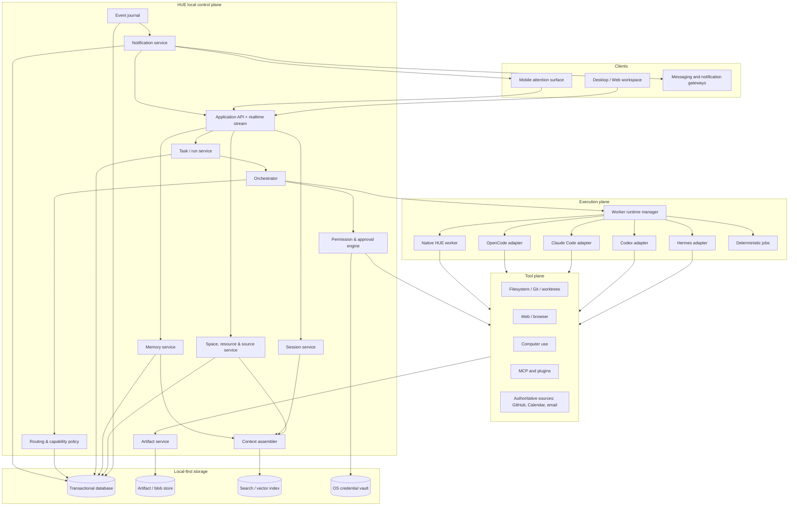

# Target system architecture

> **Focused implementation status:** `IMPLEMENTED IN PART`
> **Accepted boundary:** [ADR-0002 — Bun + Hermes ACP workspace](../decisions/0002-bun-hermes-acp-workspace.md)

## Architectural intent

HUE separates a stable **personal workspace and product control plane** from replaceable model, agent-runtime and tool backends. The workspace—not Hermes, OpenCode or a model context—owns Spaces, Sessions, context packs, task state and memory. The UI should not need to know whether a step ran through Hermes, OpenCode, Codex, Claude Code, a local model or a deterministic program, although advanced inspection remains available.

## Focused implementation boundary — accepted

The active product is smaller than the historical target architecture below. It contains only Projects, reusable Workflows, and Hermes Sessions. SvelteKit HTTP routes run under Bun; `bun:sqlite` stores Project/Workflow metadata plus message idempotency and cursor events; a supervised Hermes ACP process owns execution and Hermes conversation history. The browser sends complete acknowledged message envelopes and never PTY keystrokes.

The remaining sections are retained as historical design context, not an active implementation backlog. Capabilities outside ADR-0002 require a new product decision.

## Logical architecture — `TBI`



## Architectural layers

### Client layer — `TBI`

Renders conversations, project objects, run graphs, artifacts, approvals and computer-use previews. Clients subscribe to semantic events and never parse raw runtime logs as the source of truth.

### Application/control plane — `TBI`

Owns IDs, state transitions, policies, durable storage, context assembly, approvals and result verification. It is authoritative even when execution is delegated to another agent harness.

### Execution plane — `TBI`

Runs temporary workers through adapters. A worker runtime adapter must implement lifecycle, context/input, events, steering/cancellation, artifact claims and outcome semantics.

### Tool plane — `TBI`

Provides normalized, policy-interceptable capabilities. Direct APIs and deterministic tools are preferred; browser and computer-use tools have additional safety contracts.

### Storage layer — `TBI`

Stores transactional objects, append-only run events, artifact metadata/content, indexes and credential references. Secrets remain in the OS vault or external secret manager, never ordinary project records.

## Core service responsibilities

### Space, resource and source service

- Project/Area CRUD, subtype lifecycle and archive;
- reusable Resource relationships;
- resource roots/repositories and trust validation;
- human-readable context-pack roles, instructions, skills and source configuration;
- Space policy and memory namespace;
- bindings/projections for authoritative systems such as GitHub, Calendar, email and files;
- membership links for Sessions/tasks/artifacts/knowledge/decisions.

### Session service

- independent discussion, execution, research, monitoring and review Sessions;
- conversation/message stream and Session summaries;
- Space/context-pack binding and immutable context manifests;
- links to tasks, runs, workers and source-system objects;
- start, resume, wait, close and archive lifecycle;
- concurrent Session registry without one shared model context.

### Context assembler

- resolves ordered sources for a turn or worker;
- enforces scope, privacy and token budgets;
- records a context manifest for audit/reproduction;
- produces cache-stable session foundations and per-turn ephemeral additions.

### Knowledge and memory service

- global/Space/source/episodic namespaces;
- human-readable context-pack and second-brain file relationships;
- proposals, approval, conflict, supersession and deletion;
- backlinks, tags, epistemic provenance and retrieval;
- export and retention.

### Task/run service

- durable desired outcomes and execution attempts;
- plan graph, state transitions and checkpoints;
- ownership leases and heartbeat;
- interruption/unknown-outcome recovery;
- semantic event publication.

### Orchestrator

- determines the destination Space/Session type when a request starts in the universal inbox;
- attaches the correct context pack and authoritative source bindings;
- decides whether to answer directly, use deterministic tools, create one worker or build a multi-step plan;
- creates/updates plan graph;
- delegates with least context/capability;
- incorporates results and evidence;
- replans on failure or changed information;
- requests verification and approval;
- prevents conflicting execution, routes results to the owning Space and proposes structured state updates;
- produces final outcome.

The orchestrator is intentionally closer to an operating-system scheduler/router than an omniscient assistant. It does not keep every domain loaded; each Session obtains continuity from its Space and maintained knowledge.

### Routing policy

- maps capability requests to approved provider/model/runtime configurations;
- applies user > task > project > global precedence;
- budgets cost, latency, privacy and quality;
- selects fallbacks and records rationale;
- never mutates long-lived session foundations invisibly.

### Permission/approval engine

- evaluates every capability request against user, project, run and tool policy;
- creates informative approval objects;
- grants narrowly scoped, expiring capabilities;
- records all decisions and revocation.

### Artifact service

- ingests files and evidence by reference or content;
- tracks version, MIME type, provenance, checksum and project ownership;
- renders previews safely;
- verifies claimed side effects where possible.

### Notification service

- consumes semantic events by durable cursor and creates canonical attention records;
- classifies outcome, urgency, sensitivity and safe presentation without trusting worker-selected severity;
- applies global/device/Space/task policy, quiet hours, grouping, deduplication and escalation;
- projects in-app notifications and queues local desktop, sound and opt-in phone/gateway delivery;
- stores delivery attempts and only reports the acknowledgement strength a channel can prove;
- redacts lock-screen and third-party payloads, generates authenticated deep links and expires stale actions;
- resumes safely after restart without duplicate canonical notifications or delivery storms;
- exposes endpoint/channel health, history, test delivery, revocation and retention.

The event journal remains the source of semantic truth; the notification center is the canonical attention projection; external gateways are replaceable delivery adapters. See [Notifications, attention and delivery](16-notifications-attention-delivery.md).

## Deployment boundary — target

The default installation should run the control plane and primary data store on the user’s machine. Remote clients connect through an authenticated channel without exposing raw service ports publicly.

Optional hosted components may provide:

- model APIs;
- encrypted relay/sync;
- notification delivery;
- team collaboration;
- managed browser/computer sandboxes.

The product must remain useful without a HUE-operated cloud account.

## Runtime adapter contract — `TBI`

```typescript
interface WorkerRuntimeAdapter {
  capabilities(): RuntimeCapabilities;
  start(spec: WorkerSpec): Promise<RuntimeHandle>;
  stream(handle: RuntimeHandle): AsyncIterable<RuntimeEvent>;
  steer(handle: RuntimeHandle, message: SteeringInput): Promise<void>;
  pause(handle: RuntimeHandle): Promise<PauseResult>;
  resume(handle: RuntimeHandle): Promise<void>;
  cancel(handle: RuntimeHandle): Promise<CancelResult>;
  inspect(handle: RuntimeHandle): Promise<RuntimeSnapshot>;
  reconcile(handle: RuntimeHandle): Promise<ReconcileResult>;
}
```

Adapters translate native runtime events into HUE semantic events. They must not fabricate certainty when native state is unavailable.

## Process topology — `TBD-002`

Candidate shapes:

1. TypeScript control plane + web/Tauri client.
2. Rust core + TypeScript UI and runtime bridges.
3. Python control plane building directly on Hermes.
4. Split: small language-neutral local daemon plus runtime adapters.

Decision criteria: crash recovery, filesystem/process control, event streaming, packaging, contribution ergonomics, reuse of Hermes, type-safe contracts and cross-platform support.

## Prompt-cache/context invariant

Space settings/context-pack changes must not silently rewrite historical system prompts. A Session freezes its foundation manifest at creation; later changes are applied through explicit new-turn overlays, branch/new-Session actions, or user-approved rebase semantics. Runs always store the exact context manifest they received.

## Backend hierarchy invariant

```text
HUE Workspace UI
    ↓
HUE Space / Session / Orchestration APIs
    ↓
Runtime adapters (Hermes, OpenCode, Codex, Claude Code, native)
    ↓
Tools, models and source systems
```

No backend’s native session or memory schema becomes the canonical HUE object model. Backend handles are stored as replaceable execution references and reconciled into HUE semantic state.
