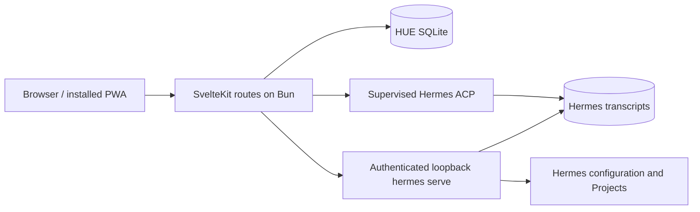

# Focused system architecture

> **Status:** `IMPLEMENTED IN PART`
> **Baseline:** [ADR-0002](decisions/0002-bun-hermes-acp-workspace.md)

## Product boundary

HUE has exactly three user-facing objects: Projects, Workflows, and Hermes Sessions. Files, terminals, Git, browser/Excalidraw, notifications, schedules, and Hermes administration are bounded supporting surfaces rather than additional HUE object types.

## Runtime topology

- SvelteKit serves the responsive workspace and same-origin HTTP API.
- `bun:sqlite` stores HUE-owned Workflows, schedules, associations, UI metadata, notification state, and durable message-delivery state.
- A supervised Hermes ACP process is the only Session execution and mutation adapter.
- A supervised, authenticated, loopback-only `hermes serve --isolated` process supplies bounded transcript reads and Hermes-owned administration APIs.
- HUE never opens or writes Hermes databases directly.

## Ownership

| Concern | Authority |
| --- | --- |
| Project identity, folders, icon, archive state | Hermes `projects.*` |
| Workflow definitions and Project association | HUE SQLite |
| Session execution and transcript persistence | Hermes through ACP |
| Project/projectless Session association and work mode | HUE SQLite |
| Message envelope, idempotency, delivery state, replay cursor | HUE SQLite |
| Hermes profiles, models, MCP | Hermes authenticated APIs |
| Schedule definition, next occurrence, and Session association | HUE SQLite |
| External cron definition, status, and explicit mutation | Hermes authenticated APIs |
| Custom skill `SKILL.md` mutation | Narrow HUE exception in ADR-0012 |
| Notification projection and delivery attempts | HUE SQLite |
| Project Excalidraw scene and workbench state | HUE SQLite |

## Delivery invariant

The browser submits one complete envelope with a client-generated ID. HUE persists it before dispatch, serializes turns per Session, deduplicates retries, and exposes monotonic event replay. A transport loss after dispatch becomes `unknown`; HUE does not automatically repeat a possibly side-effecting prompt.

Scheduled prompts follow the same invariant through a dedicated projectless Session per schedule. The Projects rail surfaces those Sessions together under Cron tasks without turning schedules into a fourth user-facing object. HUE coalesces downtime catch-up to one durable run. Existing external Hermes cron jobs may appear as Hermes-owned rows and accept explicit authenticated edits or deletion, but they are not imported and carry no HUE delivery or notification guarantee.

## Trust boundary

Loopback is the default. Remote use requires an authenticated HTTPS reverse proxy with an exact `ORIGIN`. Project paths, attachment bytes, skill content, browser input, and Hermes API responses remain untrusted. Consequential operations require server-side validation, and ACP permission requests are never granted silently.
