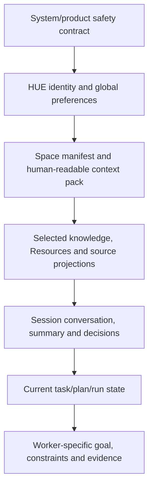
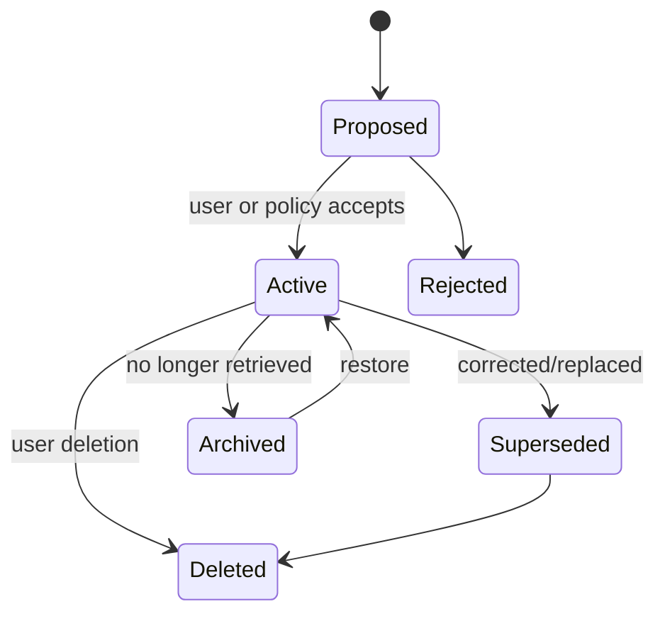

# Spaces, context packs and layered memory

> **Product status:** `TBI`
> **Open choices:** `TBD-006` memory/knowledge engine, `TBD-007` index/storage strategy, `TBD-016` cross-Space retrieval policy.

The canonical Space/session/knowledge model is also specified in [Spaces, sessions, knowledge and source ownership](03-spaces-sessions-knowledge.md).

## Space contract — `TBI`

A HUE Project or Area is simultaneously:

- an organizational home;
- a context namespace;
- a filesystem/repository scope;
- a permission policy boundary;
- a memory namespace;
- an execution and artifact boundary.

It is never merely a label applied to conversations. A Project can finish and may bind repositories/milestones; an Area is ongoing and instead emphasizes current state, routines, observations, evidence and periodic reviews.

## Space manifest

Illustrative target schema:

```yaml
id: prj_notidian
type: project
name: Notidian
description: Local-first personal knowledge workspace
status: active

resources:
  primary_root: /Users/ctw/Sites/notidian
  allowed_roots:
    - /Users/ctw/Sites/notidian
    - /Users/ctw/second brain/Projects/Notidian
  repositories:
    - path: /Users/ctw/Sites/notidian
      default_branch: main

context:
  instructions:
    - kind: inline
      text: Preserve local-first behavior and user data.
    - kind: file
      path: AGENTS.md
    - kind: file
      path: docs/architecture.md
  skills:
    - notidian-development
  knowledge_sources: []

memory:
  namespace: project:notidian
  inherit_global_categories:
    - communication_preferences
    - development_preferences
  cross_project_retrieval: deny

policy:
  filesystem:
    read: allowed_roots
    write: primary_root
  network: ask-on-first-use
  external_actions: always-ask
  computer_use: ask

routing:
  default_capability: general
  coding_capability: coding-high
  independent_review: required-for-code
```

An Area uses the same boundary contract with a different context pack and without invented repository fields:

```yaml
id: area_health
type: area
name: Health
context_pack:
  roles:
    goals: goals.md
    current_state: current-routine.md
    observations: observations.md
    questions: open-questions.md
    evidence_policy: evidence-policy.md
memory:
  namespace: area:health
policy:
  filesystem:
    read: [selected-health-notes, selected-research-library]
  repositories: deny
  github_credentials: deny
```

The storage format is `TBD`; the semantic contract is `TBI` and stable enough to implement after ADR decisions.

## Context layers



Each lower layer may narrow access but cannot broaden policy granted by a higher layer.

## Context assembly — `TBI`

For each turn or worker:

1. Resolve the active Space (Project or Area), Session type and user overrides.
2. Establish policy and privacy boundaries before content retrieval.
3. Load stable system/HUE foundation.
4. Select essential context-pack roles and configured source/Resource bindings.
5. Retrieve relevant approved memories.
6. Summarize or retrieve independent Session context within budget.
7. Add current task/run/plan state.
8. Create a least-context worker brief.
9. Produce a versioned **context manifest** listing every source, version, scope and reason included.
10. Store manifest hash with the turn/run.

The user can inspect source names and summaries; secrets and internal safety content remain protected.

## Memory layers

### Global memory — `TBI`

Stable facts and preferences that legitimately apply across Spaces:

- communication preferences;
- accessibility needs;
- stable identity facts;
- general development conventions;
- provider/privacy preferences;
- user corrections with global scope.

Global memory must not become a dumping ground for Space details.

### Space memory and context pack — `TBI`

Stable Project/Area current state, facts and decisions:

- architecture decisions;
- domain terminology;
- accepted product behavior;
- durable constraints;
- recurring procedures;
- Space-specific user corrections.

Changing GitHub issue/PR status, calendar events and email state remain projections from their authoritative source. Changing roadmap progress and raw run outputs remain in task/run systems rather than semantic memory.

### Session memory — `TBI`

Messages, branches, working summaries, attachments, context manifest and Session decisions. Session memory can be searched and summarized but is not automatically durable Space memory.

### Source memory — `TBI`

Facts retrieved from GitHub, files, Calendar, email or research, retaining source identity, freshness and evidence type. HUE never converts a stale cached projection into canonical truth.

### Episodic archive — `TBI`

Closed Sessions and completed work remain searchable and linkable but are not injected by default. Current structured state outranks old plans/transcripts.

### Task/run state — `TBI`

Plan, checkpoints, events, worker outputs, tool results, approvals and evidence. It is operational truth, retained according to policy, not injected wholesale into future conversations.

## Memory lifecycle



A memory record includes:

- namespace/scope;
- statement;
- structured type/category;
- provenance;
- confidence and verification status where relevant;
- created/updated timestamps;
- supersedes/superseded-by links;
- sensitivity and retention class;
- last retrieved/used metadata;
- author (user, HUE proposal, import).

## Memory write policy — `TBI`

- Direct user statements of stable preference/correction may be saved under explicit configured policy.
- Inferred facts are proposed, not silently asserted.
- Worker agents cannot write shared memory or context-pack files directly by default; they return reviewable proposals to HUE.
- High-sensitivity categories require explicit confirmation.
- Space memory cannot be promoted globally without user confirmation.
- Every memory must be editable, exportable and deletable.

## Cross-Space retrieval — `TBD-016`

Default recommendation: deny arbitrary Space-to-Space semantic retrieval. Permit only:

1. explicitly global memories;
2. user-linked shared collections;
3. one-time user-approved retrieval from another Space;
4. organization/team spaces with clear membership policy.

Decision must cover convenience versus confidentiality, retrieval leakage, explainability and team use.

## Space lifecycle — `TBI`

- Create a Project or Area from template; Projects may also begin from folder/repository.
- Detect existing instructions and propose imports.
- Validate roots and show trust implications.
- Archive without deleting data.
- Export a portable Space manifest, human-readable context pack, memories, Session metadata and artifact index.
- Delete with impact preview and configurable secure deletion.
- Move/attach a Session or task only after previewing context and memory consequences.

## Context conflict handling — `TBI`

When sources disagree, precedence alone is insufficient. HUE should:

- detect contradictory active memories/instructions;
- show the sources;
- avoid fabricating reconciliation;
- ask or create a decision item when consequences matter;
- record the accepted resolution and supersession.

## Acceptance outcomes

A correct implementation must prove:

- a new Space Session resolves its own context pack and relevant resources automatically;
- unrelated Space memory is absent from context manifests;
- project write access cannot escape allowed roots through symlinks/path traversal;
- changing Space context-pack files does not mutate historical Session/run manifests;
- a corrected memory stops appearing in future retrieval;
- deleting/archiving a Space has a clear, reversible-or-explicitly-destructive effect;
- context packs remain human-readable and useful without HUE;
- source projections preserve authoritative source identity and staleness.
