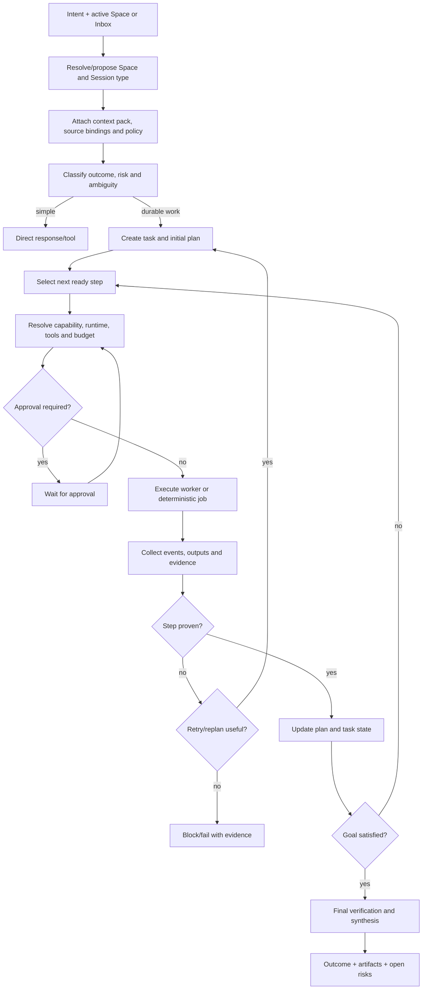

# Orchestration, workers and adaptive routing

> **Product status:** `TBI`
> **Open choices:** `TBD-003` orchestration foundation, `TBD-004` runtime ownership, `TBD-005` topology policy, `TBD-008` routing evaluation, `TBD-009` worker catalog authoring.

## Principle

The user begins inside a Space or captures an unfiled request. HUE first resolves/proposes the destination Space and Session type, attaches the controlled context pack, then decides whether the best execution is:

1. answer directly;
2. use one deterministic tool;
3. use one temporary worker;
4. execute a known deterministic workflow;
5. build a dynamic multi-step plan with specialist workers.

Multi-agent orchestration is an optimization, not a default ritual.

The orchestrator is a bounded operating-system-style scheduler/router. It tracks active and waiting Sessions, prevents conflicting execution, requests progress, routes results and proposes structured state updates. It is not expected to remain deeply informed about every codebase and life Area simultaneously.

## Orchestrator loop — `TBI`



## Plan graph — `TBI`

A plan is a versioned directed acyclic graph for normal execution, with controlled dynamic additions. Each step declares:

- desired observable outcome;
- dependencies;
- status;
- executor class/capability request;
- context/resource scope;
- permission needs;
- completion and verification criteria;
- retry/idempotency policy;
- artifacts/evidence produced.

Replanning creates a new plan revision and a human-readable change summary.

## Worker model — `TBI`

Workers are temporary execution contexts, not user-facing identities. A worker receives a manifest:

```yaml
worker_class: developer
goal: Implement responsive project navigation
project_id: prj_notidian
context_manifest: ctx_01J...
capability_request:
  domain: coding
  quality: high
  context: large
  privacy: approved-cloud
  vision: false
tools:
  allow: [file.read, file.write, git.diff, terminal.test]
resources:
  cwd: /Users/ctw/Sites/notidian
  isolation: git-worktree
limits:
  max_turns: 50
  budget_usd: 5
  deadline: 45m
verification:
  required: [typecheck, tests, diff-review]
```

The orchestrator chooses a **worker class/capability**, not arbitrary unrestricted credentials.

## Initial worker catalog — `TBI`

| Worker | Use | Typical access |
|---|---|---|
| Quick utility | classification, formatting, small transforms | minimal/safe tools |
| Researcher | current evidence and source gathering | web, browser read, files read |
| Planner/architect | ambiguous systems and plan generation | read-only project context |
| Repository explorer | fast read-only codebase understanding | file/git read, search |
| OpenCode developer | primary v0 software implementation/debugging/tests | scoped file write, terminal, worktree |
| Alternate developer | Codex/Claude Code/other runtime through same contract | scoped file write, terminal, worktree |
| Reviewer | independent review and claim verification | read-only diff/files/tests |
| Document worker | document/spreadsheet/slides production | scoped document tools |
| Browser operator | interactive web tasks | isolated browser profile |
| Computer operator | native app operation | scoped computer-use session |
| Verifier | external readback and acceptance gates | read-only/targeted probes |

Whether these are hard-coded, manifests or plugin-provided is `TBD-009`.

## Capability-based model routing — `TBI`

The orchestrator requests capabilities:

```json
{
  "domain": "coding",
  "quality": "high",
  "latency": "normal",
  "context": "large",
  "vision": false,
  "privacy": "approved-cloud",
  "budget": {"max_usd": 5}
}
```

The routing policy returns an effective route:

```json
{
  "runtime": "codex-adapter",
  "provider": "openai-codex",
  "model": "configured-coding-best",
  "effort": "high",
  "fallbacks": ["configured-coding-balanced"],
  "reason": ["coding benchmark", "large context", "project policy"]
}
```

Product code refers to policy slots/capabilities, not hard-coded current model names.

## Precedence

Highest to lowest:

1. safety and legal policy;
2. explicit current user instruction;
3. explicit task/run override;
4. project policy;
5. global user policy;
6. worker-class default;
7. system fallback.

A lower level cannot silently broaden privacy, cost or capability boundaries.

## Routing inputs — `TBI`

- domain and task type;
- complexity/ambiguity;
- context length;
- tool-call reliability;
- vision/audio requirements;
- privacy/data residency;
- latency expectation;
- cost budget/quota;
- provider health and rate limits;
- benchmark/evaluation history;
- independence requirements (review should avoid same failure mode where possible);
- user/project preference.
- Session type and authoritative source bindings.

## Route explanation — `TBI`

The user sees a concise explanation, for example:

```text
Developer selected · high-quality coding route
Why: multi-file repository change, tests required, project allows approved cloud models.
Isolation: new worktree. Review: different model family preferred.
```

Full provider metadata appears in advanced detail, not normal chat footers.

## Steering and control — `TBI`

- **Steer:** add guidance at the next safe boundary.
- **Pause:** stop scheduling new work and request worker checkpoint where supported.
- **Resume:** continue from durable state after reconciliation.
- **Cancel:** terminate active execution and mark incomplete effects truthfully.
- **Branch:** preserve current run and create a new alternative attempt.
- **Retry step:** only after idempotency/side-effect assessment.
- **Replace route:** rerun with a different worker/runtime/model policy.

## Failure semantics — `TBI`

- `failed`: execution conclusively did not satisfy step.
- `interrupted`: worker stopped but checkpoint/state is known.
- `unknown`: external effects may have occurred; inspection required.
- `blocked`: cannot continue without dependency/user/decision.
- `unverified`: worker claims completion but gates are incomplete.

No adapter may translate “process disappeared” directly into “failed safely.”

## Verification strategy — `TBI`

The worker that performs a consequential change should not be the sole authority for completion. Verification may include:

- deterministic readback;
- test/build commands;
- diff inspection;
- source/citation validation;
- UI screenshot/recording comparison;
- independent reviewer;
- remote API fetch after write;
- user acceptance.

## Orchestration anti-patterns

- Always spawning a planner, developer and reviewer for trivial work.
- Passing the full user/global memory to every worker.
- Using one shared model context for concurrent Sessions.
- Letting a backend-native Session become the canonical HUE Session record.
- Letting workers recursively spawn without depth/budget controls.
- Accepting worker prose as evidence of external side effects.
- Replanning so often the user cannot understand the current goal.
- Changing model/tool schemas inside a live cached conversation without a boundary.
- Optimizing model cost without measuring quality and retry cost.
