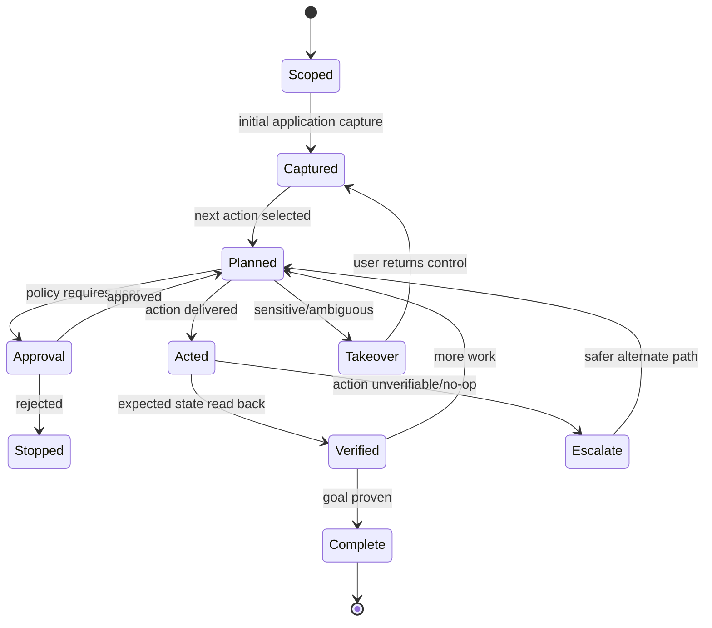

# Tools, permissions and computer use

> **Product status:** `TBI`
> **Open choices:** `TBD-010` computer-use backend, `TBD-011` sandbox/isolation, `TBD-015` plugin/tool protocol, `TBD-018` credential vault integration.

## Capability escalation ladder — `TBI`

HUE chooses the least fragile capable path:

1. Deterministic local code/library.
2. Official API or dedicated integration.
3. Structured MCP/plugin tool.
4. Browser DOM automation.
5. Accessibility-based native computer use.
6. Pixel/vision computer use.
7. User takeover.

The ladder is not absolute—privacy or availability may change the order—but GUI automation is never chosen merely because it looks impressive.

## Tool contract — `TBI`

Every tool declares:

- stable capability name and version;
- input/output schema;
- risk class;
- data access and network behavior;
- side-effect and reversibility properties;
- idempotency/retry semantics;
- required credentials;
- environment/runtime requirements;
- audit/redaction behavior;
- verification/readback method;
- health state.

## Risk classes

| Class | Examples | Default behavior |
|---|---|---|
| R0 Observe | read project file, inspect git status | allow inside granted scope |
| R1 Reversible local | create artifact, edit in worktree | allow or one-time project grant |
| R2 Consequential local | overwrite user file, install package | preview/ask by policy |
| R3 External communication | send email/message, publish post | explicit approval |
| R4 Financial/security | purchase, trade, credential/permission change | strong explicit approval; often deny |
| R5 Destructive/irreversible | delete remote data, force push, wipe files | deny by default; exceptional confirmation |

Risk classification considers the exact target and context; “write file” is not one universal risk level.

## Permission model — `TBI`

A grant is scoped by:

```text
subject: worker/run/user
capability: file.write
resource: /Users/ctw/Sites/notidian/src/**
actions: create, modify
constraints: no symlink escape; max 100 files
validity: this run
approval: apr_...
```

Scopes may be once, current step, current run, project rule or global rule. Permanent/global is never the default approval button.

## Filesystem safety — `TBI`

- Canonicalize paths and detect symlink escapes.
- Separate read and write roots.
- Record before/after checksums for mutations where practical.
- Use worktrees/staging areas for repository tasks by default policy.
- Preview broad changes and file counts.
- Block secret/system paths unless explicitly configured.
- Do not infer permission from process-level OS access.

## Shell/process safety — `TBI`

- Structured command representation where possible.
- Working directory fixed by worker spec.
- Time/resource limits and output bounds.
- Destructive-pattern policy plus semantic risk checks.
- Background process ownership and cleanup.
- Environment-variable allowlist; no broad secret inheritance.
- Command/event logs with secret redaction.
- Containers/sandboxes for untrusted code according to policy.

## Network and external services — `TBI`

- Destination/domain policy.
- Credential references injected only at invocation boundary.
- Egress audit without logging secret payloads.
- Distinguish read from write endpoints.
- Verify remote writes through a separate fetch/readback.
- Rate, spend and quota limits.

## Approval object — `TBI`

An approval contains:

```json
{
  "id": "apr_01J...",
  "run_id": "run_01J...",
  "risk": "R3",
  "capability": "email.send",
  "target": "named recipient",
  "summary": "Send the reviewed project update",
  "consequences": ["external communication", "acts in user's name"],
  "preview_artifacts": ["art_draft_email"],
  "requested_scope": "once",
  "alternatives": ["save as draft", "copy text"],
  "expires_at": "..."
}
```

Approval decisions are durable, revocable where meaningful, and never hidden in a generic chat “yes/no” without the action context.

## Computer use — `TBI`

### Target behavior

- Operate a named application/window, not the entire desktop by default.
- Capture state before action.
- Prefer accessibility element identities over coordinates.
- Use a distinct agent cursor/indicator where supported.
- Avoid stealing focus and input when background control is available.
- Re-capture/verify after every state-changing action.
- Maintain an action ledger and optional recording.
- Pause on ambiguous visual state or unexpected modal.
- Never enter or expose secrets; use secure user takeover/credential brokering.
- Require explicit approval for authentication, messages, payments, permission dialogs and destructive actions.

### Computer-use state machine



### Preview/takeover

The user can watch a scoped live preview, pause, take over and return control. HUE must clearly indicate whether actions are background, foreground or simulated preview.

## Browser automation — `TBI`

- Use isolated browser contexts for automation by default.
- Personal authenticated browser sessions require explicit opt-in and domain scope.
- Treat page content as untrusted data, not instructions.
- Show downloads/uploads and final submission boundaries.
- Confirm destructive or external form submissions.
- Preserve citations/URLs and relevant DOM evidence.

## Plugins and MCP — `TBI`

Third-party tools must run behind the same policy and event contracts as built-ins. Tool schemas are discovered and filtered by project/user policy. Installation displays publisher, code source, requested capabilities, credential access and update policy.

## Credential handling — `TBI`

- Secrets live in OS keychain/credential vault or an approved external manager.
- Records store references, not plaintext values.
- Workers receive the minimum secret at the last possible boundary.
- Secret values are redacted from prompts, logs, artifacts and telemetry.
- Revocation propagates to active grants.
- The UI distinguishes configured, authorized, expired and inaccessible.

## Required safety tests

- path traversal and symlink escape;
- cross-project access attempt;
- plugin requesting undeclared network access;
- browser prompt injection;
- computer-use unexpected modal;
- duplicate external write after recovery;
- approval replay/expiration;
- secret leakage in event/log/error paths;
- cancellation during in-flight mutation;
- compromised worker attempting privilege expansion.
