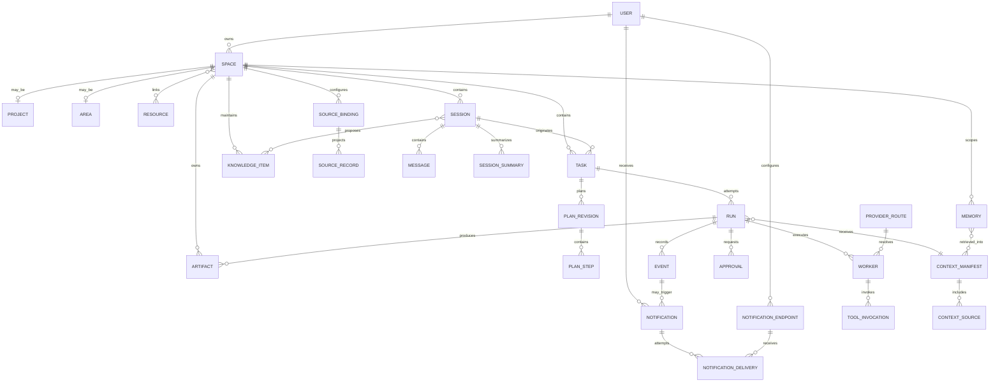
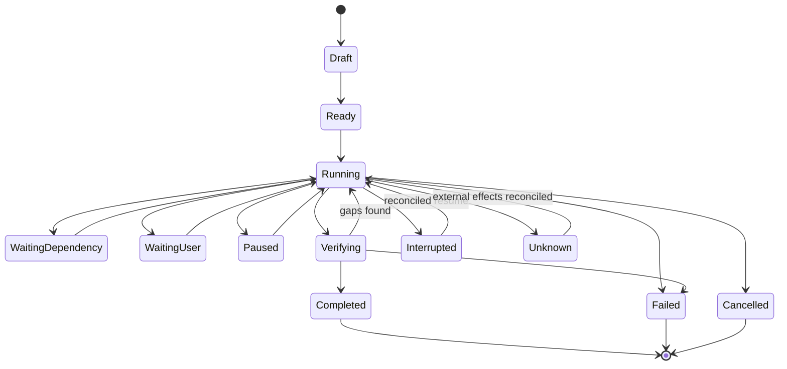

# Data model, events and service contracts

> **Product status:** `TBI`
> **Open choices:** `TBD-002` service stack, `TBD-007` storage/index, `TBD-012` event transport, `TBD-013` notification gateways, `TBD-017` sync/conflict model.

## Design rules

- Stable IDs are opaque and globally unique.
- Transactional state and append-only run history are separate concerns.
- Files remain files where possible; the database stores ownership, provenance and indexes.
- External effects are represented explicitly.
- Every run can reconstruct its input/context/policy manifest.
- State transitions are validated by the control plane, not inferred by the UI.

## Conceptual data model — `TBI`



## Key records

### Space / Project / Area

`SPACE` owns common identity, context-pack roles, policy, Sessions, knowledge, source bindings and routing defaults. `PROJECT` adds finishable outcomes and optional repository/milestone fields. `AREA` adds ongoing current-state, review-cadence and evidence-policy fields. The subtype is explicit and never inferred from the presence of a repository.

### Resource

Reusable user-owned reference such as a person, book, template, research library or archive. Relationships to Spaces are explicit. Filesystem roots/repositories and external integrations are modeled as scoped bindings rather than assuming every Resource is a project asset.

### Session/conversation/message

An independent discussion, execution, research, monitoring or review context bound to one Space/context-pack version. The Session owns human/assistant-visible messages, branches, attachments, working summaries, backend handles and task/run links. Model-facing technical events are not forced into display messages. Concurrent Sessions never share a mutable transcript/context window.

HUE Session metadata also includes `work_mode = 'autonomous' | 'live'`. It defaults to `autonomous`, survives migration, is reset to `autonomous` on fork, and is stored in `project_sessions.work_mode` with control-plane validation.

### Knowledge item

Human-readable note/file relationship with Space, tags, backlinks, version/provenance metadata and epistemic type: `personal_observation`, `agent_inference`, `external_evidence`, `professional_advice`, `decision`, or `unresolved_uncertainty`. The database indexes and relates content; files remain files where possible.

### Source binding / source record

A binding declares ownership and synchronization semantics for GitHub, Calendar, email, files or another authoritative system. A source record is HUE’s staleness-aware projection with native ID, URL/locator, version/etag, retrieved timestamp and provenance. HUE-owned Session/run state is not pushed into the source unless an explicit action requests it.

### Task

Durable desired outcome:

```json
{
  "id": "tsk_...",
  "space_id": "spc_...",
  "origin_session_id": "ses_...",
  "title": "Fix mobile navigation",
  "goal": "Observable outcome...",
  "status": "running",
  "priority": "normal",
  "risk": "R1",
  "created_by": "user",
  "policy_overrides": {},
  "current_run_id": "run_..."
}
```

### Run

One execution attempt. Stores status, effective policy, context manifest, runtime ownership, start/end timestamps, heartbeat, cost/usage aggregates, last checkpoint and outcome classification.

### Plan revision/step

Immutable revision metadata plus mutable per-run step execution state. Dependencies and acceptance criteria are machine-readable.

### Worker

Temporary specialist instance with class, runtime adapter, route, tool grant, resource scope, status and native runtime handle.

### Event

Immutable semantic record:

```json
{
  "id": "evt_...",
  "run_id": "run_...",
  "sequence": 184,
  "timestamp": "...",
  "type": "worker.tool.completed",
  "actor": "wrk_...",
  "visibility": "user-detail",
  "payload": {},
  "redaction": {"applied": true},
  "causation_id": "evt_...",
  "correlation_id": "step_..."
}
```

### Notification, endpoint and delivery attempt

A `NOTIFICATION` is the durable attention projection created from one or more semantic events. It links to the owning user/Space/Session/task/run, records class, urgency, outcome certainty, sensitivity, deduplication/group key, presentation fields, deep-link target, policy snapshot and unread/read/dismissed/acted lifecycle.

A `NOTIFICATION_ENDPOINT` identifies an authorized local device or external gateway using credential references rather than raw tokens. A `NOTIFICATION_DELIVERY` records one channel attempt with redacted payload/template identity, queued/attempted/accepted/delivered/failed/expired timestamps where knowable, provider receipt, retry count and suppression/fallback reason. “Accepted by gateway” never implies “displayed”, “read” or “acted”.

### Artifact

Name, kind/MIME, Space/Session/run ownership, content address/checksum, storage locator, version, provenance, sensitivity, preview status and relationship to changed external/source objects.

### Approval

Requested capability, target, risk, consequence summary, preview references, scope, status, expiry, decision actor and resulting grant.

### Memory

Scoped statement/structured value in a global-preference, Space, source or episodic layer; category, sensitivity, provenance, lifecycle state, supersession links and retrieval metadata.

### Context manifest

Exact ordered sources and versions supplied to a turn/worker, token/budget handling, policy, omissions and hash.

## Task/run state machine — `TBI`



Task status summarizes current intent across runs; run status describes an attempt. A task can remain active after a failed run.

## Semantic event taxonomy — `TBI`

```text
space.created|updated|archived
project.*|area.*|resource.*
session.created|resumed|summarized|closed|archived
session.work_mode_changed
message.*
knowledge.proposed|accepted|superseded|deleted
source.bound|refreshed|stale|conflicted
task.created|updated|completed|blocked
run.started|paused|resumed|interrupted|unknown|failed|completed
plan.revised
step.ready|started|blocked|completed|failed
worker.selected|started|heartbeat|steered|stopped
worker.tool.requested|started|progress|completed|failed
approval.requested|approved|rejected|expired|revoked
artifact.claimed|verified|created|updated
notification.created|updated|grouped|suppressed|queued|accepted|displayed|delivered|failed|expired|read|acted|archived
notification.endpoint_registered|authorized|revoked|health_changed
memory.proposed|accepted|superseded|deleted
inbox.captured|route_proposed|routed|kept
route.resolved|fallback|exhausted
security.policy_denied|secret_redacted
system.health_changed|recovery_required
```

Events have visibility classes: user-summary, user-detail, operator, sensitive-redacted, internal. The UI subscribes to semantic events and builds projections.

## Service/API shape — `TBI`

Exact protocol is `TBD-012`; capability domains are:

```text
spaces.*          CRUD, subtype, context pack, policy, export
resources.*       CRUD, relationships, health
sessions.*        create, type, resume, close, branch, messages, summaries
knowledge.*       query, backlinks, tags, propose revision, history
sources.*         bind, sync, inspect ownership/freshness, reconcile
inbox.*           capture, propose route, correct, keep, dispatch
context.*         preview, explain, manifest
memory.*          query, propose, accept, edit, supersede, delete
tasks.*           create, plan, start, steer, pause, resume, cancel

Focused HUE Session contract:

- `GET /api/sessions`, `GET /api/projects/:projectId/sessions`: each Session item includes `workMode`.
- `GET /api/sessions/:sessionId`, `GET /api/projects/:projectId/sessions/:sessionId`: detail includes `workMode`, transcript state, queued/running message state, and events.
- `PATCH` existing Session route with exactly `{ "workMode": "autonomous" | "live" }`: updates HUE-owned cadence state even while a turn is running, returns the effective `workMode`, and emits `session.work_mode_changed` only on actual change.
- `POST` Session message route: server applies exact natural/slash work-mode parsing before dispatch, returns the effective `workMode`, and may consume exact slash aliases without creating an agent turn.
runs.*            get, events, reconcile, retry, branch
workers.*         inspect, events, steer, terminate
approvals.*       list, inspect, decide, revoke
artifacts.*       list, preview, verify, export
notifications.*   list, subscribe, read, dismiss, archive, policy, endpoints, attempts, test
routing.*         resolve, explain, simulate, health
providers.*       configure, health, quota
system.*          health, backup, restore, diagnostics
```

Mutating requests use idempotency keys. Event subscriptions resume from sequence/cursor.

## External side-effect ledger — `TBI`

Consequential operations record:

- intended effect and target;
- idempotency key;
- request hash;
- precondition evidence;
- invocation start/finish;
- provider/native receipt or object ID;
- postcondition/readback evidence;
- outcome: confirmed, denied, failed-before-effect, unknown.

This ledger is central to safe retry and recovery.

## Retention and deletion — `TBI`

Retention applies separately to:

- Sessions/conversations;
- human-readable context packs and knowledge relationship metadata;
- source projections (never authority-owned source data without separate action);
- raw events/tool output;
- artifacts;
- recordings/screenshots;
- notification presentation records and delivery attempts;
- semantic memories;
- audit/security events;
- backups.

Deletion previews dependencies and distinguishes unlink, archive, trash and secure deletion where supported.

## Migration/versioning — `TBI`

- Schema version in database and exported manifests.
- Forward migrations are transactional with backup/rollback plan.
- Worker/plugin contracts are version negotiated.
- Space/context-pack exports remain readable through documented migration tooling.
- No silent destructive migration of memory or artifacts.
