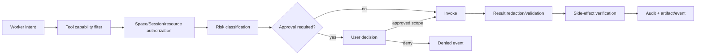

# Security, privacy and trust

> **Product status:** `TBI`
> **Open choices:** `TBD-011` isolation, `TBD-013` notification gateways, `TBD-014` mobile attention surface, `TBD-017` sync/encryption, `TBD-018` credential vault, `TBD-019` license/governance.

## Trust model

HUE is a privileged local application coordinating probabilistic workers and deterministic tools across personal data, repositories, web services and desktop applications. The security model assumes:

- model outputs can be wrong or adversarially influenced;
- web pages, documents, repositories and tool output may contain prompt injection;
- plugins and remote services may be compromised;
- runtime processes may crash at any point;
- the user may grant broad OS access but still expects HUE to enforce narrower Space/Session policy;
- logs and recordings can be as sensitive as source data.

## Security invariants — `TBI`

1. A worker cannot grant itself tools, roots, credentials, budget or time.
2. Space and Session scope is enforced outside the model prompt.
3. Untrusted content cannot modify system policy by instruction.
4. Secrets are references at rest and injected only at capability boundaries.
5. External side effects require a policy decision and durable audit record.
6. A crashed process never causes HUE to report uncertain side effects as safely failed.
7. Cross-Space retrieval is denied unless explicitly permitted.
8. The user can revoke access and stop active execution.
9. Cloud transmission is visible and policy-governed.
10. Export and deletion are first-class.
11. Notification endpoints cannot expand worker capability, and external/lock-screen payloads are minimized by policy.

## Threat surfaces

| Surface | Representative threat | Required controls |
|---|---|---|
| Model/provider | data retention, malicious output, wrong tool plan | provider policy, minimization, validation |
| Context retrieval | cross-Space leakage, stale memory | namespace enforcement, manifests, provenance |
| Knowledge/source projections | inference presented as fact, stale source treated as truth | epistemic labels, native IDs, freshness, conflict state |
| Filesystem | traversal, symlink escape, destructive edits | canonical paths, scoped grants, worktrees/backups |
| Terminal/code | arbitrary execution, secret inheritance | sandbox, env allowlist, limits, approval |
| Web/browser | prompt injection, malicious download, CSRF-like action | content isolation, domain/action policy, preview |
| Computer use | wrong window/click, sensitive UI | app scope, capture/verify, takeover, approval |
| Plugin/MCP | undeclared data/network access | signed metadata, sandbox, capability mediation |
| Event/log store | secret or private data persistence | redaction, sensitivity labels, retention |
| Notification/phone gateways | lock-screen leakage, stolen device token, forged deep link, replay/flooding | generic payload defaults, vault-backed tokens, authenticated links, signing, deduplication, revocation |
| Sync/remote access | account takeover, metadata leakage | E2E encryption decision, device auth, revocation |
| Supply chain | malicious dependency/update | signed releases, lockfiles, provenance, update control |

## Policy enforcement points — `TBI`

Enforcement lives in trusted control-plane code. Prompt instructions improve behavior but are not the boundary.

## Prompt-injection posture — `TBI`

- Treat retrieved content and tool output as data with provenance labels.
- Never execute instructions discovered in content unless the user’s task independently requires the action.
- Keep system/policy instructions out of untrusted concatenation zones.
- Require additional confirmation for actions whose only justification originated in untrusted content.
- Test indirect injection through webpages, PDFs, source comments, issue bodies, emails and image text.
- Preserve source attribution so the orchestrator can evaluate trust.

### Epistemic integrity — `TBI`

Personal observation, agent inference, external evidence, professional advice, accepted decision and unresolved uncertainty remain typed and visually distinguishable. A plausible model synthesis does not become a fact merely because it entered the second brain. Durable updates preserve author, source, time, confidence/verification state and supersession history.

### Source-of-truth drift — `TBI`

GitHub, Calendar, email and user files retain authority for their native objects. HUE projections carry native IDs/version markers and freshness. Mutations read current source state, conflicts become explicit, and stale projections cannot silently overwrite authority-owned records.

### Backend capture — `TBI`

Hermes/OpenCode/provider-native Sessions and memory must not become canonical. HUE owns the Space, Session, context, event and knowledge contracts; adapters store backend handles only. Portable context packs and adapter conformance tests make replacement possible.

## Privacy model — `TBI`

### Data locality

Default local storage for Spaces, Sessions/messages, tasks, events, knowledge relationships, memories, source projections and artifact indexes. Users can see which data categories leave the machine for each provider/tool.

### Provider disclosure

Before using a provider route, policy resolves:

- data categories transmitted;
- provider/account;
- retention/training posture where known;
- region/residency constraints;
- Space/user allow/deny state.

### Sensitive Spaces

A Project or Area can be marked local-only or restricted to an allowlist of providers/tools. This applies to routing and auxiliary services including embeddings, OCR, summaries and telemetry.

### Notification privacy

In-app notification history is local canonical state. Desktop lock screens, phone push, email, messaging gateways and webhooks are separate disclosure boundaries. They receive generic text by default and never raw prompts, logs, artifacts, paths, health details or secret-bearing errors. Space policy may force generic-only or local-only delivery. Device tokens and gateway credentials are vault-backed; deep links authenticate and re-fetch current state rather than trusting notification payloads. Consequential approvals open the full HUE attention surface and cannot be granted blindly from third-party channels. See [Notifications, attention and delivery](16-notifications-attention-delivery.md).

### Analytics

No content-bearing outbound telemetry by default. Product analytics, crash uploads or evaluation sharing require opt-in with payload preview/categories. Local observability remains available.

## Secret model — `TBI`

- Store in OS keychain or approved secret manager.
- UI displays provider/account identity and status, never values.
- Secret access is capability-scoped, purpose-bound and audited.
- Child processes receive only required environment variables.
- Logs, errors, context, memory, event payloads and artifacts pass redaction.
- Rotation/revocation is supported without rewriting Space documents.

## Identity and remote access — `TBI`

Default local single-user mode must not require cloud identity. Remote/mobile access and phone delivery require device authentication, encrypted transport, session/endpoint revocation, rate limiting and an audit trail.

**TBD-017:** Decide whether sync/remote access uses direct device networking, an encrypted relay, optional hosted account, or a combination.

## Multi-user/team mode — deferred design

Team collaboration is desired eventually but must not weaken single-user boundaries. Before team implementation, define:

- Space membership/roles;
- ownership of global versus organization memory;
- shared approvals and acting identity;
- artifact and conversation sharing;
- provider credential ownership;
- audit visibility;
- offboarding and export.

Until then, team behavior is `DEFERRED`, not implied by local Space sharing.

## User control — `TBI`

The user can:

- inspect effective permissions and active grants;
- revoke tool/provider/Space access;
- stop all workers;
- disable network or computer use globally;
- export Spaces, context packs, Sessions, source bindings and memory;
- delete memories, Sessions, raw events and artifacts according to dependency rules;
- inspect provider transmissions at category level;
- configure retention and recordings;
- configure notification channels, lock-screen privacy, sounds, quiet hours, per-Space overrides and delivery-history retention;
- revoke notification devices/endpoints and test channel health;
- run local-only mode.

## Security release gates

Before alpha:

- threat model reviewed;
- Space/path/source isolation tested adversarially;
- prompt-injection suite passes defined thresholds;
- approval bypass/replay tests pass;
- secret scanning covers logs/events/artifacts;
- crash recovery proves unknown-effect semantics;
- update and dependency provenance documented;
- local data export/restore verified;
- security disclosure policy published.
