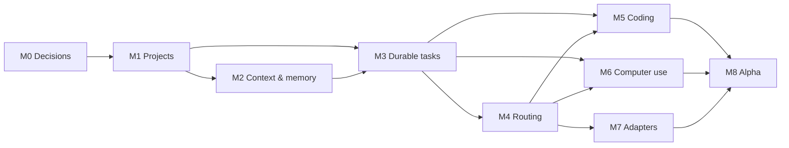

# Milestones and implementation sequence

> **Plan status:** `SPEC`
> **Product capabilities:** `TBI`
> **Open-decision work:** `TBD`

The machine-readable sources are [`../roadmap/milestones.json`](../roadmap/milestones.json) and [`../roadmap/issues.json`](../roadmap/issues.json). GitHub milestones/issues are generated from those files.

## Sequencing principle

Build a **thin, durable vertical slice** before broad capability:

```text
Project or Area → independent Session → durable task → one worker → events → artifact → verification → restart/recovery
```

Only then add adaptive multi-worker routing, coding specialization, computer use and more runtime adapters.

## M0 — Product contract and architecture decisions

**Goal:** Make the vision implementable without silent architectural assumptions.

- docs/prototype review and product contract;
- decide app shell/control-plane/runtime relationship;
- select storage/event foundations;
- choose notification gateways, phone attention surface and privacy/delivery semantics;
- define threat model, license and contribution posture;
- freeze v0 runtime adapter, Space manifest, context-pack and source-ownership contracts.

**Exit:** all alpha-blocking TBDs, including notification/phone delivery choices, have accepted ADRs; docs remain authoritative.

## M1 — Local shell and Space foundations

**Goal:** Open HUE locally and create a Project and an ongoing Area that each own their context, resources and policy.

- local app/service skeleton;
- HUE-owned token and component foundation over shell-appropriate shadcn primitives;
- database/event journal migrations;
- Project/Area CRUD, Resource relationships and trusted roots;
- shared Space overview/settings shell with subtype-specific behavior;
- filesystem trust/canonicalization;
- import/open existing repository.

**Exit:** first-run shell opens offline with HUE-owned Spaces/Sessions, shadcn-compatible HUE primitives, persistent state and honest empty/error/recovery screens.

## M2 — Sessions, context packs and portable knowledge

**Goal:** Support independent Space-bound work while preserving isolation and a useful, human-readable second brain.

- typed, independent Space-bound Sessions, messages and branches;
- portable role-based context packs and immutable context manifests;
- global, Space, source and episodic memory lifecycle;
- context inspector and memory center;
- authoritative-source bindings, portable knowledge, backlinks and epistemic provenance;
- universal Inbox routing proposals and correction workflow;
- cross-Space isolation tests.

**Exit:** fixture Spaces cannot leak context; context packs remain useful as files; Session summaries and source projections preserve provenance.

## M3 — Durable tasks, runs and visible execution

**Goal:** Turn a conversation outcome into a resumable, inspectable task.

- task/run/plan state machines;
- semantic event stream and UI projection;
- durable notification center plus local desktop/sound delivery;
- one native worker path;
- task graph/run inspector;
- pause/steer/cancel;
- restart reconciliation and outcome bundle.

**Exit:** one real task survives control-plane restart, returns verified artifact evidence and creates exactly one policy-correct local completion notification.

## M4 — Worker catalog and capability routing

**Goal:** Let HUE choose execution resources instead of asking the user.

- worker manifests/catalog;
- capability policy and precedence;
- provider/model/runtime registry and health;
- budget/fallback behavior;
- route explanation/simulation UI;
- orchestrator plan/replan and parallel dependency support;
- routing evaluation fixtures.

**Exit:** test tasks route to fast/general/coding/review capabilities correctly under privacy and override constraints.

## M5 — OpenCode-first coding workspace and artifact review

**Goal:** Deliver a trustworthy repository loop through OpenCode first without making OpenCode canonical product state.

- Git/repository service;
- managed worktrees and lifecycle;
- primary OpenCode worker adapter;
- diff/artifact viewer;
- test/build evidence ingestion;
- independent review loop;
- commit/PR approval handoff.

**Exit:** HUE completes a multi-file issue through OpenCode in a worktree, verifies tests, shows diff/review evidence and prepares a user-approved handoff.

## M6 — Permissions, browser and computer use

**Goal:** Operate beyond files without weakening user authority.

- policy engine and scoped capability grants;
- approval inbox/detail;
- browser worker with isolated sessions;
- computer-use backend and monitor;
- preview/takeover/verification;
- external side-effect ledger;
- prompt-injection and safety suites.

**Exit:** a native-app workflow completes with visible scoped actions and correctly pauses at consequential boundaries.

## M7 — Replaceable runtime adapters and ecosystem

**Goal:** Make HUE an open control plane rather than one harness wrapper.

- adapter SDK and conformance suite;
- Hermes adapter;
- Codex and Claude Code adapter pilots;
- source/tool adapter conformance beyond the primary OpenCode path;
- MCP/plugin catalog and permission mediation;
- deterministic job adapter;
- adapter health/recovery UI.

**Exit:** at least two heterogeneous runtimes can execute the same worker contract with normalized events and truthful cancellation/recovery.

## M8 — Alpha hardening and portable release

**Goal:** Ship a trustworthy local alpha.

- onboarding and diagnostics;
- backup/restore/export/import;
- packaging, signed updates and migrations;
- accessibility/mobile attention surface;
- secure opt-in phone delivery, redacted deep links and delivery diagnostics;
- performance and retention controls;
- security review/threat tests;
- dogfood and golden-task evaluation;
- contributor and release documentation.

**Exit:** security, quality, backup and operations gates pass on reference platforms, and one authorized phone channel delivers a redacted task outcome with a secure deep link.

## Dependency graph



## Issue readiness

- Issues resolving a `TBD` are labeled decision-blocked until the required investigation is complete; the ADR issue itself is ready.
- Implementation issues are `agent:ready` only when dependencies and acceptance tests are explicit.
- Each issue updates relevant documentation/status for its exact shipped scope.
- No milestone is “complete” merely because all code merged; its exit scenario must be demonstrated.

## Scope discipline

The roadmap intentionally avoids:

- team SaaS before local single-user reliability;
- a generic visual workflow builder;
- dozens of worker personas;
- automatic self-modifying prompts/policies;
- every possible provider/integration at alpha;
- full mobile parity before the attention/approval use case works.
