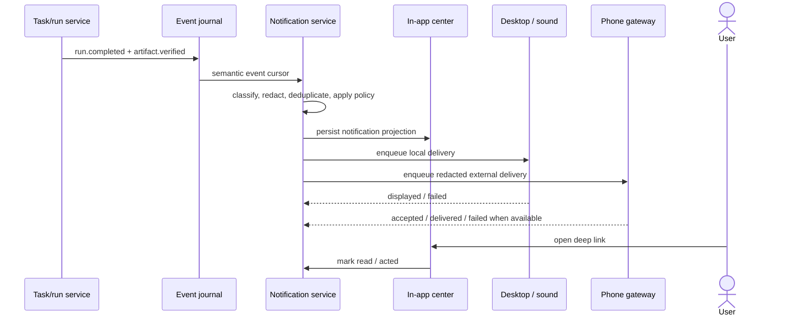
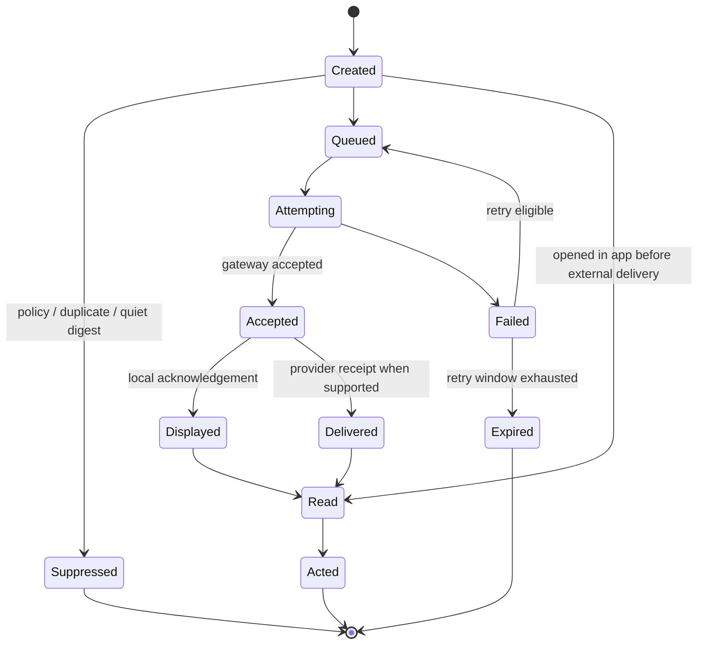

# Notifications, attention and delivery

> **Product status:** `TBI`
> **Open choices:** `TBD-013` notification gateways, `TBD-014` mobile attention surface, `TBD-017` sync and remote access.

## Purpose

HUE runs work that may finish, fail or require a decision after the user has left the application. The notification system turns durable semantic events into calm, trustworthy attention across the HUE app, operating-system notifications, optional sounds and explicitly configured phone channels.

A notification is not a transient toast and not a raw worker log line. It is a durable, inspectable attention object linked to the Space, Session, task, run, evidence and event that caused it.

## Bounded local implementation — issue 84

Current focused HUE implementation projects only five durable `session_events` kinds: `message.completed`, pending `agent.permission`, pending `agent.clarify`, `message.failed`, and `message.unknown`. Projectless Sessions remain supported. Routine chunks, thoughts, tools, plans, progress, and resolved interactions never create notifications.

SQLite stores canonical notification lifecycle, device endpoints, endpoint-scoped presence, and delivery attempts separately. Source-event sequence is unique per canonical notification, so startup projection and replay are idempotent. Persisted presentation copy and Web Push payloads stay fixed and generic: prompts, transcript text, Project/Session titles, paths, tool arguments, answers, and secret-bearing errors are never copied into them. The authenticated in-app list resolves the current Session and Project names at read time so each card identifies its context without expanding external-channel disclosure.

Web Push is optional. Configure all three values or HUE reports system delivery unavailable without failing startup:

```text
HUE_VAPID_PUBLIC_KEY
HUE_VAPID_PRIVATE_KEY
HUE_VAPID_SUBJECT=mailto:operator@example.com
```

Subscriptions require explicit browser permission from a user click. Endpoint URLs and subscription keys are credentials: APIs expose only device metadata. HUE encrypts each credential with AES-256-GCM and a persistent 32-byte local key. Default key path is `notification.key` beside configured HUE database; `HUE_NOTIFICATION_KEY_PATH` overrides it. Database directory, database file, and key modes are repaired to `0700`, `0600`, and `0600`. Missing, malformed, or inaccessible key fails startup closed; protect key backups because losing it makes stored subscriptions unreadable.

Endpoint registration records current notification baseline, so enabling or re-enabling device never replays older events. Read, dismissed, acted, or resolved-interaction notifications are excluded from delivery. Owned local timer wakes for bounded exponential retries without browser polling or new events, and service startup recovers due attempts. System-notification click marks canonical notification acted/read through same-origin mutation before safe same-origin focus/navigation; navigation continues if mutation network request fails.

Exact visible Session presence suppresses redundant completion/failure/unknown system delivery for that endpoint, while permission and clarify requests remain urgent. Canonical in-app state is never suppressed.

Foreground sound is a local opt-in unlocked by a user gesture. Background installed-PWA sound remains controlled by browser and operating-system notification channels. Wear OS mirroring is best effort and controlled by phone, browser, and watch settings; automated browser coverage is not physical-watch delivery evidence.

## Product principles — `TBI`

1. **Durable before delivered.** HUE records the notification and delivery intent before attempting an external channel, so restart cannot silently lose it.
2. **Semantic, not noisy.** Notify on meaningful state changes and user attention needs, never every tool call, token or worker heartbeat.
3. **Truthful outcomes.** “Completed” means the task reached its specified terminal state. “Verified” is distinct from “completed but unverified”; delivery status is also reported without invented certainty.
4. **In-app is canonical.** The HUE notification center and event journal remain authoritative. Phone, desktop, email and messaging channels are projections.
5. **Privacy by channel.** Lock-screen and third-party payloads use the least sensitive configured summary. Raw prompts, logs, artifacts, secrets and health/personal content are excluded by default.
6. **User-controlled interruption.** Quiet hours, per-Space policy, sound, channel, grouping and escalation are inspectable and reversible.
7. **Actionable when safe.** A notification deep-links to the exact object. High-risk approvals cannot be accepted blindly from a lock screen.
8. **No cloud requirement for local use.** In-app history, desktop notifications, sounds and delivery logs work without a HUE-operated account.

## Attention classes — `TBI`

| Class                       | Examples                                                         | Default urgency | Default behavior                                                            |
| --------------------------- | ---------------------------------------------------------------- | --------------: | --------------------------------------------------------------------------- |
| Action required             | approval, missing decision/input, recovery choice                |            high | in-app + desktop; phone if configured                                       |
| Security or budget boundary | policy denial, spend limit, suspicious access, credential expiry |   high/critical | immediate on approved channels; never suppressed silently                   |
| Outcome                     | verified completion, completed-unverified, failed, cancelled     |     normal/high | in-app; desktop/sound according to policy; phone for requested or long work |
| Time-sensitive monitoring   | deadline, threshold, scheduled monitor finding                   |      configured | notify before the event becomes stale                                       |
| Progress                    | milestone reached, long-run checkpoint                           |           quiet | in-app only unless the user explicitly subscribes                           |
| Informational               | route fallback, background reconciliation, routine update        |           quiet | activity/history; grouped or digested                                       |

The terminal outcome vocabulary remains explicit:

- **Verified:** acceptance evidence passed.
- **Completed but unverified:** execution stopped with a claimed result but required proof is incomplete.
- **Failed:** no successful terminal outcome; any external-effect uncertainty is separately represented.
- **Unknown outcome:** HUE cannot prove whether a consequential effect happened and must request inspection.
- **Cancelled:** cancellation is confirmed; otherwise the run remains stopping/interrupted/unknown.

## User journey — a compute finishes while the user is away

1. The user starts a long research, coding, rendering, training or deterministic compute task and leaves HUE.
2. The task/run service emits semantic outcome events as work progresses and verification completes.
3. Notification policy creates one durable notification for the meaningful outcome, deduplicating worker-level events.
4. The notification center shows the outcome and preserves its unread/read/acted state.
5. The local device may display an OS banner and play the configured completion sound.
6. If phone delivery is enabled, HUE sends a redacted payload such as “HUE task finished · Verified” with an authenticated deep link.
7. Opening the notification lands on the completion card with evidence, artifacts, risks and next actions—not a raw log.
8. Delivery attempts and acknowledgements remain visible in notification detail.



## Channel contract — `TBI`

### In-app notification center

Always available and canonical. It provides:

- unread and all-history views;
- **Needs attention**, **Outcomes**, **Monitoring**, **System** and per-Space filters;
- grouping by task/run and suppression of duplicate worker events;
- read, unread, dismiss, archive, mute and “notify me about this task” actions;
- links to completion cards, approvals, recovery, evidence and delivery detail;
- retention/export controls distinct from raw run-log retention.

Dismissal removes an item from the active attention view; it does not delete the underlying semantic or security record.

### Operating-system notifications

Use the native notification facility where supported. Banners contain the configured privacy level and a deep link. HUE respects OS authorization, Focus/Do Not Disturb and disabled-channel state; diagnostics distinguish **configured**, **authorized**, **available**, **healthy** and **last successful delivery**.

### Sounds

Sound is an optional local presentation of a notification, not its own source of truth.

- Separate toggles for completion, attention-required and critical alerts.
- Default completion sound is short and calm; attention-required is distinguishable without being alarming.
- Volume follows system output; HUE does not bypass mute, Focus or accessibility settings.
- Every audible event has an equivalent visible notification and screen-reader announcement.
- Per-device quiet hours and a one-click test are available.
- Repeated events group into one sound unless policy explicitly escalates.

### Phone delivery

Phone alerts are opt-in because they require an authenticated remote path. Candidate channels under `TBD-013`/`TBD-014` include:

- native or companion-app push;
- PWA web push where platform support and reliability are acceptable;
- a self-hosted or end-to-end encrypted relay;
- user-configured messaging gateways such as Telegram;
- email for low-urgency summaries/digests.

Phone notifications default to generic text on the lock screen. A user may allow task titles or richer summaries globally or per Space. Sensitive/local-only Spaces may deny external notification content entirely while still allowing a generic “HUE needs your attention” signal.

### Webhooks and automation

Webhooks are an advanced integration, not a default human-notification channel. They use signed, replay-resistant deliveries, destination allowlists, scoped event categories and redacted schemas. A webhook cannot carry an approval grant or bypass HUE policy.

## Policy and preference model — `TBI`

Effective policy resolves in this order:

1. mandatory product/security constraints;
2. explicit per-task or monitoring subscription;
3. Space policy, including sensitivity and local-only rules;
4. device/channel preferences;
5. global user defaults.

The preference matrix can configure:

- attention class and terminal outcome;
- minimum urgency;
- channels and devices;
- privacy level: generic, title, or redacted summary;
- sound on/off and sound class;
- quiet hours, timezone and temporary mute;
- immediate, grouped or digest delivery;
- repeat/escalation delay for unresolved high-priority items;
- completion threshold, such as “notify if the task ran longer than 10 minutes”;
- per-Space overrides and local-only enforcement.

Explicit user choices win only within security constraints. A worker cannot promote its own event severity, reveal more content or add a delivery endpoint.

## Grouping, throttling and escalation — `TBI`

- One task terminal outcome produces one primary notification even if several workers finish.
- Verification may update an existing “completed-unverified” notification to “verified” rather than creating noise.
- Retries use a stable deduplication key and never duplicate the canonical notification.
- Bursts are grouped by Space/task and summarized.
- Quiet hours defer normal notifications but retain them in-app; critical security boundaries follow explicit user policy.
- Approval reminders may escalate to another configured channel only after the original remains unread/unacted for the configured interval.
- Failed channels use bounded exponential backoff and an expiry. HUE never loops indefinitely or floods a gateway.

## Notification and delivery states — `TBI`



Channel capability determines the strongest truthful state. A provider HTTP `202` proves **accepted**, not **displayed** or **read**. Missing receipts remain unknown rather than being promoted to delivered.

## Data and audit contract — `TBI`

Each canonical notification records:

- stable ID, user, Space, Session, task/run and source-event links;
- attention class, urgency, outcome and sensitivity;
- title/template plus redacted presentation fields;
- deduplication/group key;
- created, read, dismissed, archived and acted timestamps;
- deep-link target and required authentication context;
- policy snapshot explaining why it did or did not notify.

Each channel attempt records:

- endpoint/device reference, never a raw secret;
- payload classification/template version and hash;
- queued/attempted/accepted/delivered/failed/expired timestamps where knowable;
- provider receipt/reference, redacted error category and retry count;
- suppression or fallback reason.

Delivery history is an operational log for user troubleshooting. Security-relevant actions also emit immutable audit events. Retention is configurable; deleting notification presentation data does not forge or rewrite required security/audit history.

## Privacy and security — `TBI`

- Device tokens, gateway credentials and signing secrets live in the OS credential vault or approved secret manager.
- External payloads exclude prompts, model output, raw logs, file paths, artifacts, health details and secret-bearing errors by default.
- Lock-screen visibility is user-configurable and can be forced generic by Space policy.
- Deep links expire where appropriate, require device/user authentication and re-fetch current canonical state instead of trusting payload data.
- Approval and other consequential actions open the authenticated HUE attention surface with full context; notification action buttons are limited to safe operations such as **Open**, **Mark read** or **Mute** until a separate risk review permits more.
- Messaging/email gateways are labeled third-party transmission and inherit provider disclosure, minimization and audit requirements.
- Endpoint registration, test delivery, revocation and device removal are audited.
- Notification content passes the same redaction/sensitivity pipeline as logs and artifacts.

## Offline, restart and failure behavior — `TBI`

- In-app records and local sounds/desktop notifications work while HUE is local-only.
- External deliveries queue while offline, subject to expiry and relevance. Reconnect reconciles before sending; stale approvals or obsolete progress notices expire.
- A control-plane restart resumes undelivered attempts from durable state without duplicating canonical notifications.
- A gateway outage is visible in diagnostics and notification detail. It does not change the task’s actual completion state.
- If every external channel fails, the notification remains visible in-app and the system surfaces channel health without recursively generating notification storms.

## Acceptance scenarios

Before the notification subsystem is considered implemented:

1. A verified long-running task creates exactly one durable in-app outcome, one configured desktop alert and one sound.
2. The same event survives control-plane restart without duplicate local or phone delivery.
3. A phone gateway receives only the configured redacted payload and opens an authenticated deep link to current task evidence.
4. Completed-unverified, verified, failed and unknown outcomes remain visibly distinct in every channel.
5. Quiet hours defer normal alerts while preserving in-app history; critical behavior follows explicit policy.
6. A burst of worker completions groups under one task outcome and emits at most one sound.
7. Disabled, unauthorized, offline, failed and expired channels are distinguishable in diagnostics and delivery history.
8. Sensitive Space policy prevents task title/content from reaching lock screens and third-party gateways.
9. Screen-reader users receive meaningful state announcements without token/tool chatter.
10. Export, retention and deletion tests cover notification records and delivery attempts without mutating required audit evidence.
