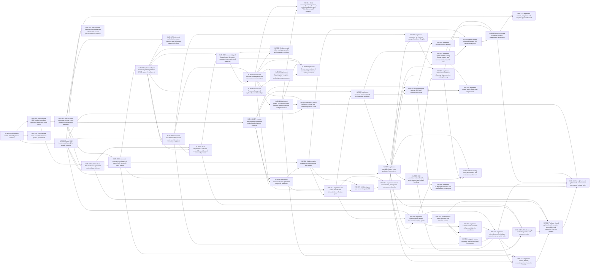

# Issue dependency graph

> Generated from `roadmap/issues.json`. Milestone colors are omitted so the graph remains legible in light and dark themes.

```mermaid
flowchart LR
    HUE_001["HUE-001 Review and freeze the HUE product contract"]
    HUE_002["HUE-002 ADR: choose HUE product boundary, app shell and control-plane stack"]
    HUE_003["HUE-003 ADR: choose canonical storage, event journal and application transport"]
    HUE_004["HUE-004 ADR: choose orchestration foundation and v0 worker/runtime contracts"]
    HUE_005["HUE-005 Create HUE threat model and alpha security baseline"]
    HUE_006["HUE-006 ADR: choose open-source license and project governance"]
    HUE_007["HUE-007 Build the local HUE shell and supervised control-plane skeleton"]
    HUE_008["HUE-008 Implement schema migrations and append-only semantic event journal"]
    HUE_009["HUE-009 Implement Space manifests plus Project/Area CRUD and archive lifecycle"]
    HUE_010["HUE-010 Implement trusted Space resource roots and filesystem boundary validation"]
    HUE_011["HUE-011 Build Project/Area overview, shared Space tabs and onboarding flows"]
    HUE_012["HUE-012 Implement typed Space-bound Sessions, messages, summaries and branches"]
    HUE_013["HUE-013 Implement portable context packs and versioned context manifests"]
    HUE_014["HUE-014 Implement global, Space, source and episodic memory lifecycle with provenance"]
    HUE_015["HUE-015 Build knowledge/memory center, context-pack editor and “Why this context?” inspector"]
    HUE_016["HUE-016 Add cross-Space isolation, retrieval and context regression suite"]
    HUE_017["HUE-017 Implement durable task, run, plan and step state machines"]
    HUE_018["HUE-018 Build semantic event projections and live run stream"]
    HUE_019["HUE-019 Implement first native worker and deterministic verification path"]
    HUE_020["HUE-020 Build task plan and live run inspector UI"]
    HUE_021["HUE-021 Implement restart reconciliation, checkpoints and outcome bundles"]
    HUE_022["HUE-022 Implement versioned worker catalog and manifest validation"]
    HUE_023["HUE-023 Implement capability-based route policy and precedence"]
    HUE_024["HUE-024 Add provider/runtime health, quota, budget and fallback handling"]
    HUE_025["HUE-025 Implement adaptive orchestrator planning, dependencies and replanning"]
    HUE_026["HUE-026 Build routing policy, explanation and evaluation workbench"]
    HUE_027["HUE-027 Implement repository service and managed worktree lifecycle"]
    HUE_028["HUE-028 Implement OpenCode-first coding worker adapter with scoped terminal and file tools"]
    HUE_029["HUE-029 Build artifact, changed-files and diff review workspace"]
    HUE_030["HUE-030 Ingest test/build evidence and add independent review loop"]
    HUE_031["HUE-031 Implement commit, merge and pull-request approval handoff"]
    HUE_032["HUE-032 Implement capability policy engine and scoped expiring grants"]
    HUE_033["HUE-033 Build approval inbox, preview and decision scopes"]
    HUE_034["HUE-034 Implement isolated browser worker with prompt-injection boundaries"]
    HUE_035["HUE-035 Integrate scoped computer-use backend and live monitor"]
    HUE_036["HUE-036 Implement external side-effect ledger and adversarial safety suite"]
    HUE_037["HUE-037 Publish runtime adapter SDK and conformance suite"]
    HUE_038["HUE-038 Implement Hermes runtime adapter"]
    HUE_039["HUE-039 Implement Codex and Claude Code adapter pilots"]
    HUE_040["HUE-040 Implement MCP/plugin mediation and deterministic job adapter"]
    HUE_041["HUE-041 Build onboarding, health diagnostics and recovery center"]
    HUE_042["HUE-042 Implement backup, restore, export/import and retention controls"]
    HUE_043["HUE-043 Package signed alpha with safe updates, accessibility and responsive attention surface"]
    HUE_044["HUE-044 Run alpha threat, golden-task, performance and dogfood release gates"]
    HUE_045["HUE-045 Implement Resource library and explicit Space relationships"]
    HUE_046["HUE-046 Implement portable second-brain relationships, backlinks and epistemic provenance"]
    HUE_047["HUE-047 Implement authoritative-source bindings and staleness-aware projections"]
    HUE_048["HUE-048 Build universal inbox routing proposals and correction workflow"]
    HUE_049["HUE-049 Implement Session summaries and structured Space-state update proposals"]
    HUE_050["HUE-050 ADR: choose portable context-pack and authoritative-source synchronization contracts"]
    HUE_001 --> HUE_002
    HUE_002 --> HUE_003
    HUE_003 --> HUE_004
    HUE_001 --> HUE_005
    HUE_001 --> HUE_006
    HUE_002 --> HUE_007
    HUE_003 --> HUE_007
    HUE_005 --> HUE_007
    HUE_003 --> HUE_008
    HUE_007 --> HUE_008
    HUE_008 --> HUE_009
    HUE_005 --> HUE_010
    HUE_009 --> HUE_010
    HUE_007 --> HUE_011
    HUE_009 --> HUE_011
    HUE_010 --> HUE_011
    HUE_009 --> HUE_012
    HUE_011 --> HUE_012
    HUE_010 --> HUE_013
    HUE_012 --> HUE_013
    HUE_013 --> HUE_014
    HUE_013 --> HUE_015
    HUE_014 --> HUE_015
    HUE_013 --> HUE_016
    HUE_014 --> HUE_016
    HUE_005 --> HUE_016
    HUE_008 --> HUE_017
    HUE_013 --> HUE_017
    HUE_004 --> HUE_017
    HUE_008 --> HUE_018
    HUE_017 --> HUE_018
    HUE_004 --> HUE_019
    HUE_017 --> HUE_019
    HUE_018 --> HUE_019
    HUE_018 --> HUE_020
    HUE_019 --> HUE_020
    HUE_019 --> HUE_021
    HUE_020 --> HUE_021
    HUE_004 --> HUE_022
    HUE_019 --> HUE_022
    HUE_022 --> HUE_023
    HUE_005 --> HUE_023
    HUE_023 --> HUE_024
    HUE_021 --> HUE_025
    HUE_023 --> HUE_025
    HUE_024 --> HUE_025
    HUE_023 --> HUE_026
    HUE_024 --> HUE_026
    HUE_025 --> HUE_026
    HUE_010 --> HUE_027
    HUE_021 --> HUE_027
    HUE_022 --> HUE_028
    HUE_027 --> HUE_028
    HUE_018 --> HUE_029
    HUE_027 --> HUE_029
    HUE_028 --> HUE_029
    HUE_025 --> HUE_030
    HUE_028 --> HUE_030
    HUE_029 --> HUE_030
    HUE_030 --> HUE_031
    HUE_005 --> HUE_031
    HUE_005 --> HUE_032
    HUE_019 --> HUE_032
    HUE_023 --> HUE_032
    HUE_032 --> HUE_033
    HUE_032 --> HUE_034
    HUE_033 --> HUE_034
    HUE_033 --> HUE_035
    HUE_010 --> HUE_035
    HUE_032 --> HUE_036
    HUE_034 --> HUE_036
    HUE_035 --> HUE_036
    HUE_021 --> HUE_036
    HUE_004 --> HUE_037
    HUE_021 --> HUE_037
    HUE_022 --> HUE_037
    HUE_037 --> HUE_038
    HUE_028 --> HUE_039
    HUE_037 --> HUE_039
    HUE_032 --> HUE_040
    HUE_037 --> HUE_040
    HUE_011 --> HUE_041
    HUE_021 --> HUE_041
    HUE_024 --> HUE_041
    HUE_036 --> HUE_041
    HUE_008 --> HUE_042
    HUE_014 --> HUE_042
    HUE_021 --> HUE_042
    HUE_036 --> HUE_042
    HUE_007 --> HUE_043
    HUE_033 --> HUE_043
    HUE_041 --> HUE_043
    HUE_042 --> HUE_043
    HUE_016 --> HUE_044
    HUE_026 --> HUE_044
    HUE_030 --> HUE_044
    HUE_036 --> HUE_044
    HUE_040 --> HUE_044
    HUE_043 --> HUE_044
    HUE_009 --> HUE_045
    HUE_013 --> HUE_046
    HUE_045 --> HUE_046
    HUE_003 --> HUE_047
    HUE_009 --> HUE_047
    HUE_009 --> HUE_048
    HUE_012 --> HUE_048
    HUE_013 --> HUE_048
    HUE_012 --> HUE_049
    HUE_013 --> HUE_049
    HUE_014 --> HUE_049
    HUE_046 --> HUE_049
    HUE_003 --> HUE_050
```
